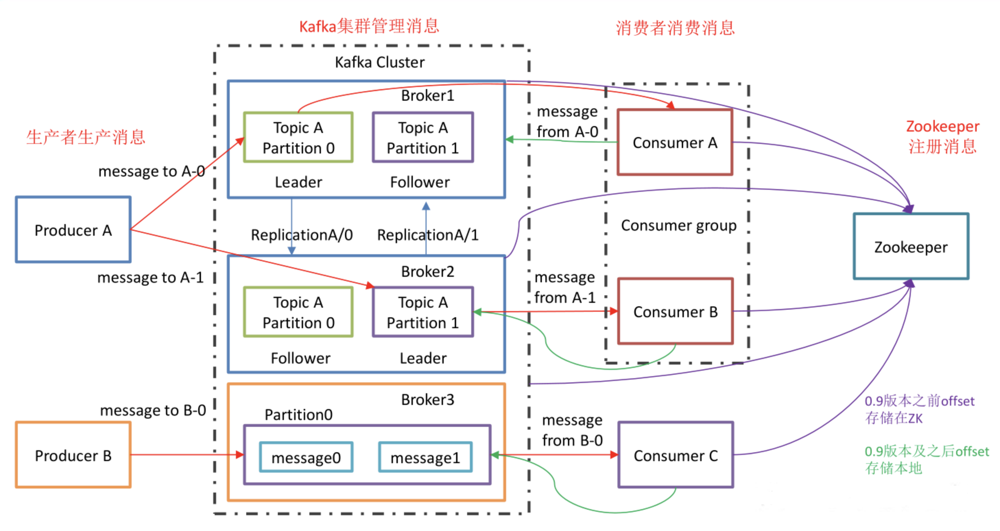

# Kafka 架构图

1. **Broker**：一台 kafka 服务器就是一个broker。一个集群由多个broker组成。一个broker可以容纳多个topic。

2. **Producer** ：消息生产者，就是向 Kafka broker 发消息的客户端。

3. **Consumer** ：消息消费者，向 Kafka broker 拉取消息来消费。可以根据 Consumer 的消费能力以适当的速率消费消息。

4. **Topic** ：可以理解为一个队列，生产者和消费者面向的都是一个topic。

5. **Partition**：为了实现扩展性，一个非常大的 topic 可以分布到多个broker上，一个 topic 可以分为多个partition，每个 partition 是一个有序的队列，有点平衡分摊生产者机制。

6. **Replication**：为保证集群中的某个节点发生故障时，该节点上的partition数据不丢失，且kafka仍然能够继续工作，kafka提供了副本机制，一个topic的每个分区都有若干个副本，一个leader和若干个follower。

7. **leader**：一个分区有一个Leader，生产者发送数据的对象，以及消费者消费数据的对象都是leader。

8. **follower**：一个分区有一个Follower，实时从 leader 中同步数据，保持和 leader 数据的同步。leader 发生故障时，某个 follower 会成为新的 follower。注意Kafka中 副本数不能超过Broker数！

9. **Consumer Group** ：消费者组由多个 consumer 组成。组内每个消费者负责消费不同分区的数据，一个分区只能由一个组内消费者消费；消费者组之间互不影响。所有的消费者都属于某个消费者组，即消费者组是逻辑上的一个订阅者。

10. **offset**：消费者在具体消费某个 topic 中的消息时，可以指定起始偏移量。

    在Kafka 0.9前，Committed Offset信息保存在zookeeper的[consumers/{group}/offsets/{topic}/{partition}]目录中（zookeeper其实并不适合进行大批量的读写操作，尤其是写操作）。而在0.9之后，所有的offset信息都保存在了Broker上的一个名为__consumer_offsets的topic中

11. **Coordinator**:协调者,用于接收Consumers的心跳,管理consumer的join group,assign partition 等事件.

