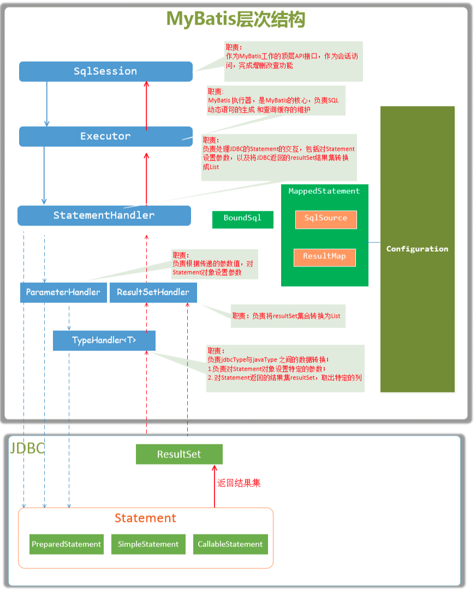

# Mybatis 核心组件

- `Configuration`     MyBatis所有的配置信息都保存在Configuration对象之中，配置文件中的大部分配置都会存储到该类中
- `SqlSession`       作为MyBatis工作的主要顶层API，表示和数据库交互时的会话，完成必要数据库增删改查功能
  - `DefaultSqlSession` 大多有该类实现，通过调用Exector组件来实现增删改查
- `Executor`        MyBatis执行器，是MyBatis 调度的核心，负责SQL语句的生成和查询缓存的维护
  - `BaseExecutor` 具体底层由 `StatementHandler`来进行增删改查
    - `SimpleExecutor` 
    - `ReuseExecutor`
    - `BatchExecutor`
  - `CachingExecutor`  增加了缓存功能，具体底层查询还是有`BaseExecutor` 下的子类完成
- `StatementHandler` 封装了JDBC Statement操作，负责对JDBC statement 的操作，如设置参数等
  - `BaseStatementHandler`
    - `PreparerdStatementHandler`
    - `SimpleStatementHandler`
    - `CallbleStatementHandler`
  - `RoutingStatementHandler`可通过`MappedStatement.statementType`指定使用`BaseSetatementHandler`的子类来执行
- `ParameterHandler`  负责对用户传递的参数转换成JDBC Statement 所对应的数据类型
  - `DefaultParameterHandler`
- `ResultSetHandler`  负责将JDBC返回的ResultSet结果集对象转换成List类型的集合
  - `DefaultResultSetHandler`
- `TypeHandler`      负责java数据类型和jdbc数据类型(也可以说是数据表列类型)之间的映射和转换
- `MappedStatement`  MappedStatement维护一条<select|update|delete|insert>节点的封装
- `SqlSource`        负责根据用户传递的parameterObject，动态地生成SQL语句，将信息封装到BoundSql对象中，并返回
- `BoundSql`        表示动态生成的SQL语句以及相应的参数信息

