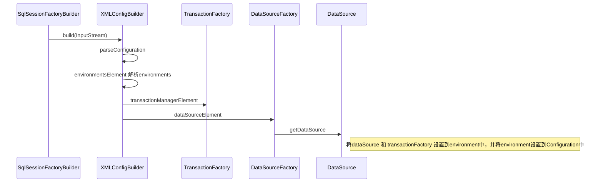

# DataSource创建

```mermaid
sequenceDiagram
    SqlSessionFactoryBuilder ->> XMLConfigBuilder : build(InputStream)
    XMLConfigBuilder ->> XMLConfigBuilder : parseConfiguration
    XMLConfigBuilder ->> XMLConfigBuilder : environmentsElement 解析environments
    XMLConfigBuilder ->> TransactionFactory : transactionManagerElement
    XMLConfigBuilder ->> DataSourceFactory : dataSourceElement
    DataSourceFactory ->> DataSource : getDataSource
    Note right of DataSource : 将dataSource 和 transactionFactory 设置到environment中，并将environment设置到Configuration中
```

