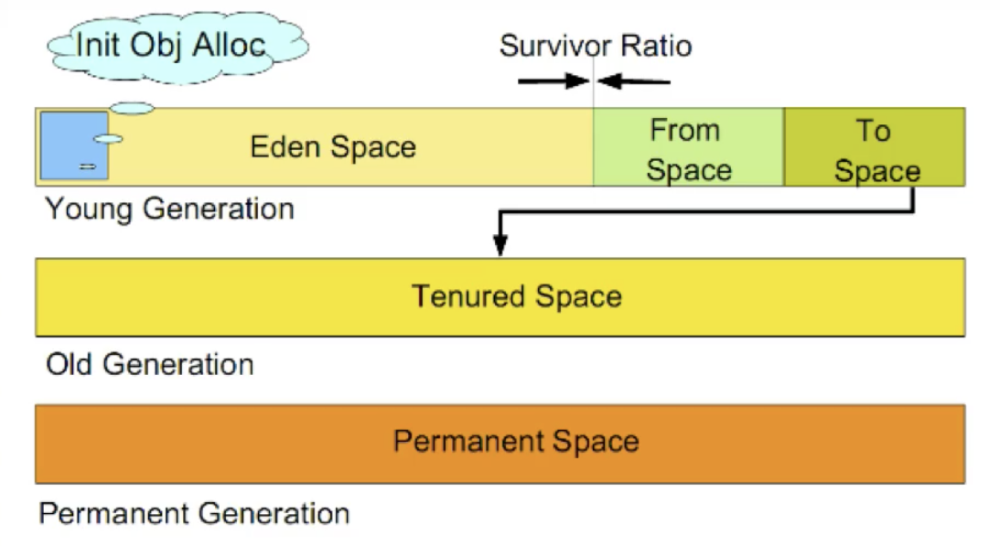
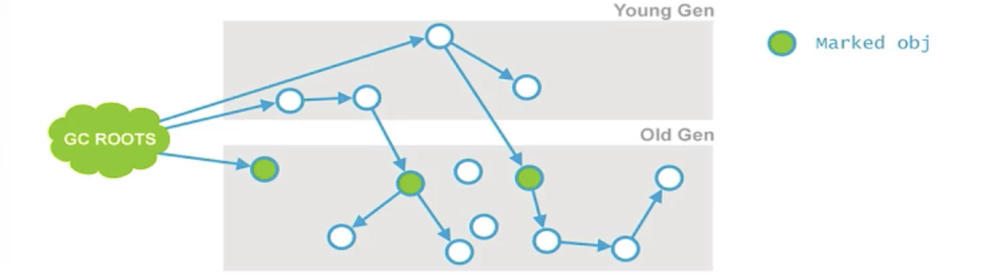

[TOC]


## 类加载、连接与初始化

- 在Java代码中，类型（定义的class,interface等）的加载、连接与初始化过程都是在程序运行期间完成的

- ### 类加载器

  - ###### java虚拟机与程序的生命周期

  - 在如下几种情况下，java虚拟机将结束生命周期

    - 执行了`System.exit()`方法
    - 程序正常执行结束
    - 程序在执行过程中遇到了异常或错误而异常终止
    - 由于操作系统出现错误而导致java虚拟机进程终止

##### 加载

> - 查找并加载类的二进制文件
>
> > 类的加载指的是将类的.class 文件中的二进制数据读入到内存中，将其放在运行时数据区的方法区内，然后在内存中创建一个`java.lang.Class`对象(规范并未说明Class对象位于哪里，HotSpot虚拟机将其放在了方法区中)用来封装类的方法区内的数据结构
>
> - 加载.class 文件的方式
>   - 从本地系统中直接加载
>   - 通过网络下载.class文件
>   - 从zip，jar等归档类文件中加载.class文件
>   - 从转悠数据库中提取.class文件
>   - 将java源文件动态编译为.class文件
>- **有两种类型的加载器**
> 
>   - Java虚拟机自带的加载器
>      - 根类加载器（`Bootstrap`）
>        - 扩展类加载器（`Extension`）
>         - 系统（应用）类加载器（`System`）
>    - 用户自定义的类加载器
>      - `java.lang.ClassLoader`的子类
>      - 用户可以定制类的加载方式
> - 类加载器并不需要等到某个类被“首次主动使用”时再加载它
>   - JVM规范允许类加载器在预料某个类将要被使用时就预先加载它，如果在预先加载的过程中遇到> 了class文件缺失或存错误，类加载器必须在**程序首次主动**使用该类时才报告错误(`LinkageError`错误)
>    - 如果这个类一直没有被程序主动使用， 那么**类加载器就不会报告错误**
>

##### 连接

> 类被加载后，就进入连接阶段。连接就是将已经读入到内存的类的二进制数据合并到虚拟机的运行时环境中去。
>
> - 验证：确保被加载的类的正确性
>
>   - 验证内容：
>     - 类文件的结构检查
>     - 语义检查
>     - 字节码验证
>     - 二进制兼容性的验证
>
> - 准备：为类的**静态变量**分配内存，并将其初始化为**默认值**
>
>   - 在准备阶段，Java 虚拟机为类的静态变量分配内存，并设置默认的初始值。例如对于以下Sample类，准备阶段，将为int类型的静态变量a分配4个字节的内存空间，并且赋予默认值0，为long类型的静态变量分配8个字节的内存空间，并且赋予默认值0。
>
>     ```java
>     public class Sample{
>     	private static int a=1 ;
>     	public static long b;
>               
>     	static {
>     		b=2;
>       }
>       ...
>     }
>               
>     ```
>
>     
>
> - 解析：**把类中的符号引用转换为直接引用**？

##### 初始化

> - **为类的静态变量赋予正确的初始值**
>
>   在初始化阶段，Java 虚拟机执行类的初始化语句，为类的静态变量赋予初始值。在程序中，静态变量的初始化有两种途径:  在静态变量的声明处进行初始化;在静态代码块中进行初始化。例如在以下代码中，静态变量a和b都被显式初始化，而静态变量c没有被显式初始化，它将保持默认值0。
>
>   ```java
>   public class Sample{
>   	private static int a=1; //在静态变量的声明处进行初始化
>   	public static long b;
>   	public static long C;
>     
>   	static {
>   		b=2; //在静态代码块中进行初始化
>     }
>     ...
>   }
>   ```
>
>   静态变量的声明语句，以及静态代码块都被看做类的初始化语句，Java 虚拟机会按照初始化语句在类文件中先后顺序来依次执行它们。例如当以下Sample类被初始化后，它的静态变量a的取值为4。
>
>   ```java
>   public class Sample{
>   	static int a=1;
>   	
>   	static{ a=2; }
>   	static{ a=4; }
>   	
>   	public static void main(String args[]){
>   		System. out .println("am"+a); //打印a=4
>   	}
>   }
>   ```
>
> - 类的初始化步骤
>
>   - 假如这个类还没有被加载和连接，那就先进行加载和连接
>   - 假如类存在直接父类，并且这个父类还没有被初始化，那就先初始化直接父类
>   - 假如类中存在初始化语句，那就依次执行这些初始化语句

###### 初始化时机

-  java程序对类的使用方式可以分为两种

  - 主动使用
    - 创建类的实例
    - 访问某个类或接口的静态变量，或者对该静态变量赋值
    - 调用类的静态方法
    - 反射（如`Class.forName("com.test.Test")`）
    - 初始化一个类的子类
    - java虚拟机启动时被标明为启动类的类
    - JDK1.7开始提供的动态语言支持：`java.lang.invoke.MethodHandle` 实例的解析结果 `REF_getStatic`，`REF_putStatic`，`REF_invokeStatic` 句柄对应得类没有初始化，则初始化
- 当一个接口中定义了JDK 8新加入的默认方法（被default 关键字修饰的接口方法）时，如果有这个接口的实现类发生初始化，那该接口要在其之前被初始化
  
- 被动使用
  
  - 除以上情况，其他使用java类的方式都被看作是对类的**被动使用**，都不会导致类的**初始化**
  
    
    
    
  
- 所有的java虚拟机实现必须在每个类或接口被java程序“**首次主动使用**”时才初始化

- **当Java 虚拟机初始化-一个类时，要求它的所有父类都已经被初始化，但是这条规则并不适用于接口。**

  - 在初始化一个类时， 并不会先初始化它所实现的接口。
  - 在初始化一个接口时， 并不会先初始化它的父接口。

  

  因此，一个父接口并不会因为它的子接口或者实现类的初始化而初始化。只有当程序首次使用特定接口的静态变量时，才会导致该接口的初始化。

- 调用`ClassLoader`类的`loadClass`方法加载一个类，并不是对类的主动使用，不会导致类的初始化。

- 类加载器用来把类加载到Java虚拟机中。从JDK 1.2 版本开始，类的加载过程采用双亲委托机制，这种机制能更好地保证Java平台的安全。在此委托机制中，除了Java虚拟机自带的根类加载器以外，其余的类加载器都有且只有一个父加载器。当Java程序请求加载器loaderl加载Sample类时, loaderl首先委托自己的父加载器去加载Sample类，若父加载器能加载，则由父加载器完成加载任务，否则才由加载器loaderl 本身加载Sample类。

##### 常量本质

- 编译时期能够确定的常量会在编译器放到被调用类的常量表中

```java
/**
 * 注意：这里指的是将常量存到 MyTest2 的常量池中，之后 MyTest2 和 MyParent2 就没有任何关系了。甚至我们可以将 MyParent2 的 class
 * 文件删除（编译完之后），程序还可以执行。
 * 助记符：反编译之后可以看到
 * <p>
 * 助记符 ldc：表示将 int、float 或者 String 类型的常量值从常量池中推送至栈顶
 * 助记符 bipush：表示将单字节（-128-127）的常量值推送到栈顶
 * 助记符 sipush：表示将一个短整型值（-32768-32369）推送至栈顶
 * 助记符 iconst_1：表示将 int 型的 1 推送至栈顶（iconst_m1 ~ iconst_5(对应于 -1 到 5)值，6 之后使用 bipush）
 */
public class MyTest2 {
    public static void main(String[] args) {
        // 输出：MyParent static block、 hello world
        System.out.println(MyParent2.str1);
        // 输出：hello world
        System.out.println(MyParent2.str);
        System.out.println(MyParent2.s);
        System.out.println(MyParent2.i);
        System.out.println(MyParent2.j);
    }
}

// 因为先编译后加载，所有该类并没有被加载
class MyParent2 {
    public static String str1 = "hello world";
    public static final String str = "hello world";
    public static final short s = 7;
    public static final int i = 129;
    public static final int j = 1;

    static {
        System.out.println("MyParent static block");
    }
}

```

- 编译时期能够不能够确定的常量，其值不会被放到使用类的常量池中当程序运行时会主动使用这个常量所在的类，从而出发这个类的初始化。

```java
import java.util.UUID;

/**
 * 在运行 MyTest3 的 main 时，必须有 MyParent3.class 存在；
 * 这里因为 MyParent3.str 的值不能在编译阶段确定，所以 MyParent3 会被主动使用，对应的静态代码块执行。
 *
 * @author GJXAIOU
 */
public class MyTest3 {
    public static void main(String[] args) {
        // 下面语句输出结果为：
        //MyParent3 static block
        //82fcced1-a3e3-4c39-b4e8-b8a01b32c478
        System.out.println(MyParent3.str);
    }
}

class MyParent3 {
    public static final String str = UUID.randomUUID().toString();

    static {
        System.out.println("MyParent3 static block");
    }
}
```

##### 类加载器

- Java虚拟机自带了以下几种加载器。
  - 根 (`Bootstrap`)类加载器:该加载器没有父加载器。它负责加载虚拟机的核心类库,如`java.lang.*`等。`java.lang.Object`就是由根类加载器加载的。根类加载器从系统属性`sun.boot.class.path`所指定的目录中加载类库。根类加载器的实现依赖于底层操作系统，属于虚拟机的实现的一部分，它并没有继承`java.lang.ClassLoader`类。
  - 扩展(`Extension`) 类加载器:它的父加载器为根类加载器。它从`java.ext.dirs`系统属性所指定的目录中加载类库,或者从JDK的安装目录的`jre\liblext`子目录(扩展目录)下加载类库，如果把用户创建的JAR文件放在这个目录下，也会自动由扩展类加载器加载。扩展类加载器是纯Java 类，是`java.lang.ClassLoader`类的子类。
  - 系统 (`System`)类加载器:也称为应用类加载器，它的父加载器为扩展类加载器。它从环境变量`classpath`或者系统属性`java.class.path`所指定的目录中加载类，它是用户自定义的类加载器的默认父加载器。系统类加载器是纯Java类，是`java.lang.ClassLoader`类的子类。
  - 除了以上虚拟机自带的加载器外，用户还可以定制自己的类加载器。Java提供了抽象类`java.lang.ClassLoader`,所有用户自定义的类加载器都应该继承`ClassLoader`类。

###### 类加载器的双亲委派机制

- 在双亲委派机制中，各个加载器按照父子关系形成了**树形结构**，除了根类加载器之外，其余的类加载器都有且只有一个父加载器


###### 命名空间

- 每个类加载器都有自己的命名空间，命名空间由该加载器及所有父加载器所加载的类组成。
- 在同一个命名空间中，不会出现类的完整名字(包括类的包名)相同的两个类
- 在不同的命名空间中，有可能会出现类的完整名字(包括类的包名)相同的两个类

###### 线程上下文加载器

- 当前类加载器(Current Classloader)

    ​	每个类都会使用自己的类加载器(即加载自身的类加载器)来去加载其他类，(指的是所依赖的类)如果Classx引用了ClassY,那么ClassX的类加载器就会 去加载ClassY (前提是ClassY尚未被加载)
- 线程上下文类加载器(Context Classloader)
    	线程上下文类加载器是从JDK 1.2开始引入的，`java.lang.Thread#getContextClassLoader`与`java.lang.Thread#setContextClassLoader`分别用来获取和设置上下文类加载器。
        	如果没有通过`java.lang.Thread#setContextClassLoader`进行设置的话，线程将继承其父线程的上下文类加载器。Java应用运行时的初始线程的上下文类加载器是系统类加载器。在线程中运行的代码可以通过该类加载器来加载类与资源。
- 线程上下文类加载器的重要性:
    ​	SPI (Service Provider Interface)
    ​	父ClassLoader可以使用当前线程`Thread#currentThread#getContextClassLoade`所指定的classloader加载的类。这就改变了父classLoader不能使用子ClassLoader或是其他没有直接父子关系的ClassLoader加载的类的情况，即改变了双亲委托模型。
- 线程上下文类加载器就是当前线程的Current Classloader.
    ​	在双亲委托模型下，类加载是由下至上的，即下层的类加载器会委托上层进行加载。但是对于sPI来说，有些接口是Java核心库所提供的，而Java核心库是由启动类加载器来加载的，而这些接口的实现却来自于不同的jar包(厂 商提供)，Java的启动类加载器是不会加载其他来源的jar包，这样传统的双亲委托模型就无法满足SPI的要求。而通过给当前线程设置上下文类加载器，就可以由设置的上下文类加载器来实现对于接口实现类的加载。

###### 不同类加载器的命名空间的关系

- 同一个命名空间内的类是相互可见的。
- 子加载器的命名空间包含所有父加载器的命名空间。因此由子加载器加载的类能看见父加载器加载的类。例如系统类加载器加载的类能看见根类加载器加载的类。
- 由父加载器加载的类不能看见子加载器加载的类。
- 如果两个加载器之间没有直接或间接的父子关系，那么它们各自加载的类相互不可见。

#### 类的卸载

- 当MySample类被加载、连接和初始化后，它的生命周期就开始了。当代表MySample类的Class对象不再被引用，即不可触及时，Class对象就会结束生命周期，MySample类在方法区内的数据也会被卸载，从而结東MySample类的生命周期。
- **一个类何时结束生命周期，取决于代表它的Class对象何时结束生命周期**

- 由Java虚拟机自带的类加载器所加载的类，在虚拟机的生命周期中，始终不会被卸载。前面已经介绍过，Java 虚拟机自带的类加载器包括根类加载器、扩展类加载器和系统类加载器。Java 虚拟机本身会始终引用这些类加载器，而这些类加载器则会始终引用它们所加载的类的Class对象，因此这些Class对象始终是可触及的。
- 由用户自定义的类加载器锁加载的类是可以被卸载的。


## Java字节码

### 整体结构

| 大小      | 名称             | 描述                                                |
| --------- | ---------------- | --------------------------------------------------- |
| 4个字节   | Magic Number     | 魔数，值为`0xCAFEBABE`，Java创始人James Gosling制定 |
| 2+2个字节 | Version          | 包括minor_verson和major_version                     |
| 2+n个字节 | Constant Pool    | 包括字符串常量值、数值常量等                        |
| 2个字节   | Access Flags     | 当前类访问标志符                                    |
| 2个字节   | This Class Name  |                                                     |
| 2个字节   | Super Class Name |                                                     |
| 2+n个字节 | Interfaces       |                                                     |
| 2+n个字节 | Fields           |                                                     |
| 2+n个字节 | Methods          |                                                     |
| 2+n个字节 | Attributes       |                                                     |

|      类型      |               名称               |         数量          |
| :------------: | :------------------------------: | :-------------------: |
|       u4       |           magic(魔数)            |           1           |
|       u2       |     minor_version(次版本号)      |           1           |
|       u2       |     major_version(主版本号)      |           1           |
|       u2       | constant_pool_count(常量池个数)  |           1           |
|    cp_info     |          Constant_pool           | constant_pool_count-1 |
|       u2       |           Access_flag            |           1           |
|       u2       |         this_class(类名)         |           1           |
|       u2       |       super_class(父类名)        |           1           |
|       u2       |    interfaces_count(接口个数)    |           1           |
|       u2       |        interfaces(接口名)        |   interfaces_count    |
|       u2       |       fields_count(域个数)       |           1           |
|       u2       |          fields(域的表)          |     fields_count      |
|       u2       |    methods_count(方法的个数)     |           1           |
|  method_info   |         methods(方发表)          |     methods_count     |
|       u2       | attributes_count(附加属性的个数) |           1           |
| attribute_info |     attributes(附加属性的表)     |   attributes_count    |

```java
ClassFile {
	u4								magic;
	u2								minorversion;
	u2								major_version;
	u2								constant_pool_count; 
	cp_info						contant_pool [constant_pool_count - 1] ;
	u2								access_flags;
	u2								this_class;
	u2								super_class;
	u2								interfaces_count;
	u2								interfaces [interfaces_count] ;
	u2								fields_count ;
	field_info				fields[fields_count] ;
	u2								methods_count;
	method_info				methods [methods_count] ;
	u2								attributes_count;
	attribute_ info		attributes [attributes_count] ;
}
```

#### 字节码结构

- Class字节码中有两种数据类型
  - 字节数据直接量:这是基本的数据类型。共细分为u1、u2、u4、u8四种，分别代表连续的1个字节、2个字节、4个字节、8个字节组成的整体数据。
  - 表(数组) :表是由多个基本数据或其他表，按照既定顺序组成的大的数据集合。表是有结构的，它的结构体现在:组成表的成分所在的位置和顺序都是已经严格定义好的。

#### 常量表

##### 常量池数据结构总表

<table style=" text-align:center;color:black" >
	<tr style="background-color: #fac090">
    <th><font color="black">常量</font></th>
    <th><font color="black">项目</font></th>
    <th><font color="black">类型</font></th>
    <th><font color="black">描述</font></th>
	</tr>
  <tr style="background-color:#dbe5f1">
    <td style="display:table-cell; vertical-align:middle" rowspan='3'>CONSTANT_Utf8_info</td>
    <td>tag</td>
    <td>U1</td>
    <td align='left'>值为1</td>
  </tr>
  <tr style="background-color:#dbe5f1">
    <td>length</td>
    <td>U2</td>
    <td align='left'>UTF-8编码的字符串长度</td>
  </tr>
   <tr style="background-color:#dbe5f1">
    <td>bytes</td>
    <td>U1</td>
    <td align='left'>长度为length的UTF-8编码的字符串</td>
  </tr>
  <tr style="background-color:#eaf1dd">
    <td style="display:table-cell; vertical-align:middle" rowspan='2'>CONSTANT_Ingeter_info</td>
    <td>tag</td>
    <td>U1</td>
    <td align='left'>值为3</td>
  </tr>
  <tr style="background-color:#eaf1dd">
    <td>bytes</td>
    <td>U4</td>
    <td align='left'>按照高位在前存储的int值</td>
  </tr>
  <tr style="background-color:#dbe5f1">
    <td style="display:table-cell; vertical-align:middle" rowspan='2'>CONSTANT_Float_info</td>
    <td>tag</td>
    <td>U1</td>
    <td align='left'>值为4</td>
  </tr>
  <tr style="background-color:#dbe5f1">
    <td>bytes</td>
    <td>U4</td>
    <td align='left'>按照高位在前存储的float值</td>
  </tr>
  <tr style="background-color:#eaf1dd">
    <td style="display:table-cell; vertical-align:middle" rowspan='2'>CONSTANT_Long_info</td>
    <td>tag</td>
    <td>U1</td>
    <td align='left'>值为5</td>
  </tr>
  <tr style="background-color:#eaf1dd">
    <td>bytes</td>
    <td>U8</td>
    <td align='left'>按照高位在前存储的long值</td>
  </tr>
  <tr style="background-color:#dbe5f1">
    <td style="display:table-cell; vertical-align:middle" rowspan='2'>CONSTANT_Double_info</td>
    <td>tag</td>
    <td>U1</td>
    <td align='left'>值为6</td>
  </tr>
  <tr style="background-color:#dbe5f1">
    <td>bytes</td>
    <td>U8</td>
    <td align='left'>按照高位在前存储的double值</td>
  </tr>
  <tr style="background-color:#eaf1dd">
    <td style="display:table-cell; vertical-align:middle" rowspan='2'>CONSTANT_Class_info</td>
    <td>tag</td>
    <td>U1</td>
    <td align='left'>值为7</td>
  </tr>
  <tr style="background-color:#eaf1dd">
    <td>index</td>
    <td>U2</td>
    <td align='left'>指向全限定名常量项的索引</td>
  </tr>
  <tr style="background-color:#dbe5f1">
    <td style="display:table-cell; vertical-align:middle" rowspan='2'>CONSTANT_String_info</td>
    <td>tag</td>
    <td>U1</td>
    <td align='left'>值为8</td>
  </tr>
  <tr style="background-color:#dbe5f1">
    <td>index</td>
    <td>U2</td>
    <td align='left'>指向字符串字面量的索引</td>
  </tr>
  <tr style="background-color:#eaf1dd">
    <td style="display:table-cell; vertical-align:middle" rowspan='3'>CONSTANT_Fieldref_info</td>
    <td>tag</td>
    <td>U1</td>
    <td align='left'>值为9</td>
  </tr>
  <tr style="background-color:#eaf1dd">
    <td>index</td>
    <td>U2</td>
    <td align='left'>指向声明字段的类或者接口描述符CONSTANT_class_info的索引项</td>
  <tr style="background-color:#eaf1dd">
    <td>index</td>
    <td>U2</td>
    <td align='left'>指向字段描述符CONSTANT_NameAndType_info的索引项</td>
  </tr>
  <tr style="background-color:#dbe5f1">
    <td style="display:table-cell; vertical-align:middle" rowspan='3'>CONSTANT_Methodref_info</td>
    <td>tag</td>
    <td>U1</td>
    <td align='left'>值为10</td>
  </tr>
  <tr style="background-color:#dbe5f1">
    <td>index</td>
    <td>U2</td>
    <td align='left'>指向声明方法的类描述符CONSTANT_Class_info的索引项</td>
  </tr>
  <tr style="background-color:#dbe5f1">
    <td>index</td>
    <td>U2</td>
    <td align='left'>指向名称及类型描述符CONSTANT_NameAndType_info的索引项</td>
  </tr>
  <tr style="background-color:#eaf1dd">
    <td style="display:table-cell; vertical-align:middle" rowspan='3'>CONSTANT_InterfaceMethodref_info</td>
    <td>tag</td>
    <td>U1</td>
    <td align='left'>值为11</td>
  </tr>
  <tr style="background-color:#eaf1dd">
    <td>index</td>
    <td>U2</td>
    <td align='left'>指向声明方法的接口描述符CONSTANT_class_info的索引项</td>
  <tr style="background-color:#eaf1dd">
    <td>index</td>
    <td>U2</td>
    <td align='left'>指向名称及类型描述符CONSTANT_NameAndType_info的索引项</td>
  </tr>
  <tr style="background-color:#dbe5f1">
    <td style="display:table-cell; vertical-align:middle" rowspan='3'>CONSTANT_NameAndTyperef_info</td>
    <td>tag</td>
    <td>U1</td>
    <td align='left'>值为12</td>
  </tr>
  <tr style="background-color:#dbe5f1">
    <td>index</td>
    <td>U2</td>
    <td align='left'>指向该字段或方法名称常量项的索引</td>
  </tr>
  <tr style="background-color:#dbe5f1">
    <td>index</td>
    <td>U2</td>
    <td align='left'>指向该字段或方法描述符常量项的索引</td>
  </tr>
  <tr style="background-color:#eaf1dd">
    <td style="display:table-cell; vertical-align:middle" rowspan='3'>CONSTANT_MethodHandle_info</td>
    <td>tag</td>
    <td>U1</td>
    <td align='left'>值为15</td>
  </tr>
  <tr style="background-color:#eaf1dd">
    <td>reference_kind</td>
    <td>U1</td>
    <td align='left'>值必须在1至9之间（包括1和9），他决定了方法句柄的类型。方法句柄类型的值表示方法句柄的字节码行为</td>
  </tr>
  <tr style="background-color:#eaf1dd">
    <td>reference_index</td>
    <td>U2</td>
    <td align='left'>值必须是对常量池的有效索引</td>
  </tr>
  <tr style="background-color:#dbe5f1">
    <td style="display:table-cell; vertical-align:middle" rowspan='2'>CONSTANT_MethodType_info</td>
    <td>tag</td>
    <td>U1</td>
    <td align='left'>值为16</td>
  </tr>
  <tr style="background-color:#dbe5f1">
    <td>descriptor_index</td>
    <td>U2</td>
    <td align='left'>值必须是对常量池的有效索引，常量池在改所引出的项必须是CONSTANT_Utf8_info结构，表示方法的描述符</td>
  </tr>
  <tr style="background-color:#eaf1dd">
    <td style="display:table-cell; vertical-align:middle" rowspan='3'>CONSTANT_Dynamic_info</td>
    <td>tag</td>
    <td>U1</td>
    <td align='left'>值为17</td>
  </tr>
  <tr style="background-color:#eaf1dd">
    <td>bootstrap_method_attr_index</td>
    <td>U2</td>
    <td align='left'>值必须是对当前Class文件中引导方法表的bootstrap_methods[]数组的有效索引</td>
  </tr>
  <tr style="background-color:#eaf1dd">
    <td>name_and_type_index</td>
    <td>U2</td>
    <td align='left'>值必须是对当前常量池的有效索引，常量池在该索引处的项必须是CONSTANT_NameAndType_info结构，表示方法名和方法描述符</td>
  </tr>
  <tr style="background-color:#dbe5f1">
    <td style="display:table-cell; vertical-align:middle" rowspan='3'>CONSTANT_InvokeDynamic_info</td>
    <td>tag</td>
    <td>U1</td>
    <td align='left'>值为18</td>
  </tr>
  <tr style="background-color:#dbe5f1">
    <td>bootstrap_method_attr_index</td>
    <td>U2</td>
    <td align='left'>值必须是对当前Class文件中引导方法表的bootstrap_methods[]数组的有效索引</td>
  </tr>
  <tr style="background-color:#dbe5f1">
    <td>name_and_type_index</td>
    <td>U2</td>
    <td align='left'>值必须是对当前常量池的有效索引，常量池在该索引处的项必须是CONSTANT_NameAndType_info结构，表示方法名和方法描述符</td>
  </tr>
  <tr style="background-color:#eaf1dd">
    <td style="display:table-cell; vertical-align:middle" rowspan='2'>CONSTANT_Module_info</td>
    <td>tag</td>
    <td>U1</td>
    <td align='left'>值为19</td>
  </tr>
  <tr style="background-color:#eaf1dd">
    <td>name_index</td>
    <td>U2</td>
    <td align='left'>值必须是对常量池的有效索引，常量池在该索引处的项必须是CONSTANT_Utf8_info结构，表示模块名称</td>
  </tr>
  <tr style="background-color:#dbe5f1">
    <td style="display:table-cell; vertical-align:middle" rowspan='2'>CONSTANT_Package_info</td>
    <td>tag</td>
    <td>U1</td>
    <td align='left'>值为20</td>
  </tr>
  <tr style="background-color:#dbe5f1">
    <td>name_index</td>
    <td>U2</td>
    <td align='left'>值必须是对常量池的有效索引，常量池在改所引出的项必须是CONSTANT_Utf8_info结构，表示包名称</td>
  </tr>
</table>


#### Access_Flag访问标志符

- 访问标志信息包括该Class文件是类还是接口，是否被定义成public,是否是abstract，如果是类，是否被声明成final

| 标志名称       | 标志值   | 含义                                                         |
| -------------- | -------- | ------------------------------------------------------------ |
| ACC_PUBLIC     | `0x0001` | 是否为public类型                                             |
| ACC_FINAL      | `0x0010` | 是否被声明成final，只有类可以设置                            |
| ACC_SUPER      | `0x0020` | 是否允许使用invokesepcial字节码指令的新语义，invokespecial指令的含义在JDK1.0.2发生过改变，为了区别这条指令使用哪种语义，JDK1.0.2之后编译出来的类的这个标志都必须为真 |
| ACC_INTERFACE  | `0x0200` | 标识这是一个接口                                             |
| ACC_ABSTRACT   | `0x0400` | 是否为abstract类型，对于接口或者抽象类来说，此标志为真，其他类型为假 |
| ACC_SYNTHENTIC | `0x1000` | 标识这个类并非由用户代码产生的                               |
| ACC_ANNOTATION | `0x2000` | 标识这是个注解                                               |
| ACC_ENUM       | `0x4000` | 标识这是个枚举                                               |
| ACC_MODULE     | `0x8000` | 标识这是个模块                                               |

示例：`0x0021`：是`0x0020`和`0x0001`的并集，标识ACC_PUBLIC与ACC_SUPER

#### 字段表

- 字段表用于描述类和接口中声明的变量。这里的字段包含了类级别变量以及实例变量，但是不包括方法内部声明的局部变量

##### 字段表结构

| 类型           | 名称             | 数量             |
| -------------- | ---------------- | ---------------- |
| u2             | access_flags     | 1                |
| u2             | name_index       | 1                |
| u2             | descriptor_index | 1                |
| u2             | attributes_count | 1                |
| attribute_info | attributes       | attributes_count |

```java
field_info{
	u2 access_flags; 0002
	u2 name_index; 0005
	u2 descriptor_index; 0006
	u2 attributes_count; 0000
	attribute_info attributes[attributes_count];
}
```

##### 字段访问标志

| 标志名称      | 标志值   | 含义                     |
| ------------- | -------- | ------------------------ |
| ACC_PUBLIC    | `0x0001` | 字段是否public           |
| ACC_PRIVATE   | `0x0002` | 字段是否private          |
| ACC_PROTECTED | `0x0004` | 字段是否protected        |
| ACC_STATIC    | `0x0008` | 字段是否static           |
| ACC_FINAL     | `0x0010` | 字段是否final            |
| ACC_VOLATILE  | `0x0040` | 字段是否volatile         |
| ACC_TRANSIENT | `0x0080` | 字段是否transient        |
| ACC_SYNTHETIC | `0x1000` | 字段是否由编译器自动产生 |
| ACC_ENUM      | `0x4000` | 字段是否enum             |

##### 描述符标识字符含义

| 标识字符 | 含义                             |
| -------- | -------------------------------- |
| B        | 基本类型`byte`                   |
| C        | 基本类型`char`                   |
| D        | 基本类型`double`                 |
| F        | 基本类型`float`                  |
| I        | 基本类型`int`                    |
| J        | 基本类型`long`                   |
| S        | 基本类型`short`                  |
| Z        | 基本类型`boolean`                |
| V        | 特殊类型`void`                   |
| L        | 对象类型，如`Ljava/lang/Object;` |


#### 方法表

##### 方法表结构

| 类型           | 名称             | 数量             |
| -------------- | ---------------- | ---------------- |
| u2             | access_flags     | 1                |
| u2             | name_index       | 1                |
| u2             | descriptor_index | 1                |
| u2             | attributes_count | 1                |
| attribute_info | attributes       | attributes_count |

```java
method_info{
	u2 access_flags; 0002
	u2 name_index; 0005
	u2 descriptor_index; 0006
	u2 attributes_count; 0000
	attribute_info attributes[attributes_count];
}
```


##### 方法访问标志符

| 标志名称         | 标志值   | 含义                             |
| ---------------- | -------- | -------------------------------- |
| ACC_PUBLIC       | `0x0001` | 字段是否public                   |
| ACC_PRIVATE      | `0x0002` | 字段是否private                  |
| ACC_PROTECTED    | `0x0004` | 字段是否protected                |
| ACC_STATIC       | `0x0008` | 字段是否static                   |
| ACC_FINAL        | `0x0010` | 字段是否final                    |
| ACC_SYNCHRONIZED | `0x0020` | 字段是否synchronzied             |
| ACC_BRIDGE       | `0x0040` | 方法是不是由编译器产生的桥接方法 |
| ACC_VARARGS      | `0x0080` | 方法是否接受不定参数             |
| ACC_NATIVE       | `0x0100` | 方法是否为native                 |
| ACC_ABSTRACT     | `0x0400` | 方法是否为abstract               |
| ACC_STRICT       | `0x0800` | 方法是否为strictfp               |
| ACC_SYNTHETIC    | `0x1000` | 字段是否由编译器自动产生         |

#### 属性结构

- JVM预定义了部分attribute，但是编译器自己也可以实现自己的attribute写入class文件里，公运行时使用。
- 不同的attribute通过attribute_name_index来区分

##### 属性表结构

| 类型 | 名称                 | 数量             |
| ---- | -------------------- | ---------------- |
| u2   | attribute_name_index | 1                |
| u4   | attribute_length     | 1                |
| u1   | info                 | attribute_length |

```
attribute_info{
	u2 attribute_name_index;
	u2 attribute_length;
	u1 info[attribute_length]
}
```


##### 虚拟机规范预定义的属性

<style>
table td:first-of-type {
    width: 10%;
}
table td:nth-of-type(2) {
    width: 35%;
}
table td:nth-of-type(3) {
    width: 50%;
}
</style>

<table>
  <tr>
    <th style='text-align:left; width:10%;'>属性名称</th>
    <th style='text-align:center; width:35%;'>使用位置</th>
    <th style='text-align:left;width:%;'>含义</th>
  </tr>
  <tr>
    <td style='text-align:left;'>Code</td>
    <td style='text-align:center;'>方发表</td>
    <td style='text-align:left;'>Java代码编译成的字节码指令</td>
  </tr>
  <tr>
    <td style='text-align:left;'>ConstantValue</td>
    <td style='text-align:center;'>字段表</td>
    <td style='text-align:left;'>有final关键字含义的常量值</td>
  </tr>
  <tr>
    <td style='text-align:left;'>Deprecated</td>
    <td style='text-align:center;'>类、方法表、字段表</td>
    <td style='text-align:left;'>被声明为deprecated的方法和字段</td>
  </tr>
  <tr>
    <td style='text-align:left;'>Exceptions</td>
    <td style='text-align:center;'>方法表</td>
    <td style='text-align:left;'>方法抛出的异常列表</td>
  </tr>
  <tr>
    <td style='text-align:left;'>EnclosingMethod</td>
    <td style='text-align:center;'>类文件</td>
    <td style='text-align:left;'>仅当一个类为局部类或者匿名类时才能拥有这个属性，这个属性用于标示这个类所在的外围方法</td>
  </tr>
  <tr>
    <td style='text-align:left;'>InnerClasses</td>
    <td style='text-align:center;'>类文件</td>
    <td style='text-align:left;'>内部类列表</td>
  </tr>
  <tr>
    <td style='text-align:left;'>LineNumberTable</td>
    <td style='text-align:center;'>Code属性</td>
    <td style='text-align:left;'>Java源码的行号与字节码指令的对应关系</td>
  </tr>
  <tr>
    <td style='text-align:left;'>LocalVariableTable</td>
    <td style='text-align:center;'>Code属性</td>
    <td style='text-align:left;'>方法的局部变量描述</td>
  </tr>
  <tr>
    <td style='text-align:left;'>StackMapTable</td>
    <td style='text-align:center;'>Code属性</td>
    <td style='text-align:left;'>JDK6中新增的属性，供新的类型检查验证器（Type Checker）检查和处理目标方法的局部变量和操作数栈所需要的类型与匹配</td>
  </tr>
  <tr>
    <td style='text-align:left;'>Signature</td>
    <td style='text-align:center;'>类、方法表、字段表</td>
    <td style='text-align:left;'>JDK5中新增的属性，用于支持范型情况下的方法签名。在Java语言中，任何类、接口、初始化方法或成员的泛型签名如果包含了类型变量(Type Variables)
      或参数化类型( Parameterized Types), 则Signature属性会为它记录泛型签名信息。由于Java的范型采用擦除法实现，为了避免类型信息被擦除后导致签名混乱，需要这个属性记录范型中的相关信息
    </td>
  </tr>
  <tr>
    <td style='text-align:left;'>SourceFile</td>
    <td style='text-align:center;'>类文件</td>
    <td style='text-align:left;'>记录源文件名称</td>
  </tr>
  <tr>
    <td style='text-align:left;'>SourceDebugExtension</td>
    <td style='text-align:center;'>类文件</td>
    <td style='text-align:left;'>JDK 5中新增的属性，用于存储额外的调试信息。譬如在进行JSP文件调试时，无法通过Java堆栈来定位到JSP文件的行号，JSR
      45提案为这些非Java语言编写，却需要编译成字节码并运行在Java虚拟机中的程序提供了一个进行调试的标准机制，使用该属性就可以用于存储这个标准所新加人的调试信息</td>
  </tr>
  <tr>
    <td style='text-align:left;'>Synthetic</td>
    <td style='text-align:center;'>类、方法表、字段表</td>
    <td style='text-align:left;'>标识方法或字段为编译器自动生成的</td>
  </tr>
  <tr>
    <td style='text-align:left;'>LocalVariableTypeTable</td>
    <td style='text-align:center;'>类</td>
    <td style='text-align:left;'>JDK5中新增的属性，它使用特征签名代替描述符，是为了引人泛型语法之后能描述泛型参数化类型而添加</td>
  </tr>
  <tr>
    <td style='text-align:left;'>RuntimeVisibleAnnotations</td>
    <td style='text-align:center;'>类、方法表、字段表</td>
    <td style='text-align:left;'>JDK5中新增的属性，为动态注解提供支持，该属性用于指明哪些注解是运行时（实际上运行时就是进行反射）可见的</td>
  </tr>
  <tr>
    <td style='text-align:left;'>RuntimeInvisibleAnnotations</td>
    <td style='text-align:center;'>类、方法表、字段表</td>
    <td style='text-align:left;'>JDK5中新增的属性，与RuntimeVisibleAnnotations属性刚好相反，用于指明哪些注解是运行时不可见的</td>
  </tr>
  <tr>
    <td style='text-align:left;'>RuntimeVisibleParameterAn-<br/>notations</td>
    <td style='text-align:center;'>方法表</td>
    <td style='text-align:left;'>JDK5新增的属性，作用于RuntimeVisibleAnnotations属性类似，只不过作用对象为方法参数</td>
  </tr>
  <tr>
    <td style='text-align:left;'>RuntimeInvisibleParameter-<br/>Annotations</td>
    <td style='text-align:center;'>方法表</td>
    <td style='text-align:left;'>JDK5新增的属性，作用于RuntimeInvisibleAnnotations属性类似，只不过作用对象为方法参数</td>
  </tr>
  <tr>
    <td style='text-align:left;'>AnnotationDefault</td>
    <td style='text-align:center;'>方法表</td>
    <td style='text-align:left;'>JDK5中新增的属性，用于记录注解类元素的默认值</td>
  </tr>
  <tr>
    <td style='text-align:left;'>BootstrapMethods</td>
    <td style='text-align:center;'>类文件</td>
    <td style='text-align:left;'>JDK7中新增的属性，用于保存invokedynamic指令应用的引导方法限定符</td>
  </tr>
  <tr>
    <td style='text-align:left;'>RuntimeVisibleTypeAnnota-<br/>tions</td>
    <td style='text-align:center;'>类、方法表、字段表，Code属性</td>
    <td style='text-align:left;'>JDK8中新增的属性，为实现JSR308中新增的类型注解提供的支持，用于指明哪些类注解是运行时（实际上运行时就是进行反射调用）可见的</td>
  </tr>
  <tr>
    <td style='text-align:left;'>RuntimeInvisibleTypeAnno-<br/>tations</td>
    <td style='text-align:center;'>类、方法表、字段表，Code属性</td>
    <td style='text-align:left;'>
      JDK8中新增的属性，为实现JSR308中新增的类型注解提供的支持，与RuntimeVisibleTypeAnnotations属性作用刚好相反，用于指明哪些注解是运行时不可见的</td>
  </tr>
  <tr>
    <td style='text-align:left;'>MethodParameters</td>
    <td style='text-align:center;'>方法表</td>
    <td style='text-align:left;'>
      JDK8中新增的属性，用于支持（编译时加上-parameters参数）将方法名称编译进Class文件中，并可运行时获取。此前要获取方法名称（典型的如IDE的代码提示）只能通过JavaDoc中得到</td>
  </tr>
  <tr>
    <td style='text-align:left;'>Module</td>
    <td style='text-align:center;'>类</td>
    <td style='text-align:left;'>JDK9中新增的属性，用于记录一个Module的名称以及相关信息（requires、exports、opens、users、provides）</td>
  </tr>
  <tr>
    <td style='text-align:left;'>ModulePackages</td>
    <td style='text-align:center;'>类</td>
    <td style='text-align:left;'>JDK9中新增的属性，用于记录一个模块中所有被expores或者opens的包</td>
  </tr>
  <tr>
    <td style='text-align:left;'>ModuleMainClass</td>
    <td style='text-align:center;'>类</td>
    <td style='text-align:left;'>JDK9中新增的属性，用于指定一个模块的主类</td>
  </tr>
  <tr>
    <td style='text-align:left;'>NestHost</td>
    <td style='text-align:center;'>类</td>
    <td style='text-align:left;'>JDK11中新增的属性，用于支持嵌套类（Java中的内部类）的反射和访问控制的API，一个内部类通过该属性的得知自己的堵住类</td>
  </tr>
  <tr>
    <td style='text-align:left;'>NestMembers</td>
    <td style='text-align:center;'>类</td>
    <td style='text-align:left;'>JDK11中新增的属性，用于支持嵌套类（JAVA中的内部类）的反射和控制访问的API，一个宿主类通过该属性得知自己有哪些内部类</td>
  </tr>
</table>

###### Code属性

- Code attribute的作用是保存该方法的结构。

| 类型           | 名称                   | 数量                   |
| -------------- | ---------------------- | ---------------------- |
| u2             | attribute_name_index   | 1                      |
| u4             | attribute_length       | 1                      |
| u2             | max_stack              | 1                      |
| u2             | max_locals             | 1                      |
| u4             | code_length            | 1                      |
| u1             | code                   | code_length            |
| u2             | exception_table_length | 1                      |
| exception_info | exception_table        | exception_table_length |
| u2             | attreibutes_count      | 1                      |
| attribute_info | attributes             | attributes_count       |

```
Code_ attribute {
	u2 attribute_name_index;
	u4 attribute_length;
	u2 max_stack;
	u2 max_locals; 
	u4 code_length;
	ul code[code_length];
	u2 exception_table_length;
	{
		u2 start_pc;
		u2 end_pc;
		u2 handler_pc;
		u2 catch_type;
	} exceptio_table [exception_table_length];
	u2 attributes_count;
	attribute_info attributes [attributes_count];
}
```

- attribute_length表示attribute所包含的字节数，不包含attribute_name_index和attribute_length字段。
- max_stack表   示这个方法运行的任何时刻所能达到的操作数栈的最大深度
- max_locals表示方法执行期间创建的局部变量的数目，包含用来表示传入的参数的局部变量
- code_length表示该方法所包含的字节码的字节数以及具体的指令码
- 具体字节码即是该方法被调用时，虚拟机所执行的字节码
- exception_table，这里存放的是处理异常的信息
- 每个exception_table表项由start_pc,end_pc,handler_pc,catch_type组成
-   start_pc和end_pc表示在code数组中从start_pc到end_pc出（包含start_pc,不包含end_pc）的指令抛出的异常会由这个表项来处理
- handler_pc表示处理异常的代码的开始处
- catch_type表示会被处理的异常类型，它指向常量池里的一个异常类。当catch_type为0时，表示处理所有的异常

###### Exceptions属性

- 列举出方法中可能抛出的受查异常（Checked Exception），也就是方法描述时throws关键字后面列举的异常。

| 类型 | 名称                  | 数量                 |
| ---- | --------------------- | -------------------- |
| u2   | attribute_name_index  | 1                    |
| u4   | attribute_length      | 1                    |
| u2   | number_of_exceptions  | 1                    |
| u2   | exception_index_table | number_of_exceptions |

```
Exception_attribute{
	u2 attribute_name_index;
	u4 attribute_length;
	u2 number_of_exceptions;
	u2 exception_index_table;
	{
		u2 number_of_exceptions;
	}
}
```


- number_of_exceptions项标识方法可能抛出number_of_exceptions中受查异常，每一种受查异常使用一个exception_index_table项表示；exception_index_table是一个指向常量池中CONSTANT_Class_info型常量的所有，代表了该受查异常的类型。

###### LineNumberTable属性

- LineNumberTable：这个属性用来表示code数组中的字节码和Java代码行数之间的关系。这个属性可以用来在调试的时候定位代码执行的行数。

```
LineNumberTable_attribute{
	u2 attribute_name_index;
	u4 attribute_length;
	u2 line_number_table_length;
	{
		u2 start_pc;
		u2 line_number;
	}
	line_number_table[line_number_table_length];
}
```

###### LocalVariableTable及LocalVaribleTypeTable属性

- LocalVariableTable属性用于描述栈帧中局部变量表的变量与Java源码中定义的变量之间的关系。
- LocalVaribleTypeTable属性结构与LocalVariableTable非常相似，仅仅是把记录的字段描述的descriptor_index替换成了字段的特征签名（Signature），对于非泛型类型来说，描述符和特征签名能描述的信息是能吻合一致的，但是泛型引入后，由于描述符中泛型的参数化类型被擦除掉，描述符就不能准确描述泛型类型了。因此出现了LocalVaribleTypeTable属性，使用字段的特征签名来完成泛型的描述。

| 类型                | 名称                 | 数量                        |
| ------------------- | -------------------- | --------------------------- |
| u2                  | attribute_name_index | 1                           |
| u4                  | attribute_length     | 1                           |
| u2                  | number_of_exceptions | 1                           |
| local_variable_info | local_variable_table | local_variable_table_length |

**local_variable_info项目结构**

| 类型 | 名称             | 数量 |
| ---- | ---------------- | ---- |
| u2   | start_pc         | 1    |
| u2   | length           | 1    |
| u2   | name_index       | 1    |
| u2   | descriptor_index | 1    |
| u2   | index            | 1    |

###### SourceFile属性

- 用于记录生成这个Class文件的源码文件名称。

| 类型                | 名称                 | 数量                        |
| ------------------- | -------------------- | --------------------------- |
| u2                  | attribute_name_index | 1                           |
| u4                  | attribute_length     | 1                           |
| u2                  | 1                    |1|

###### SourceDebugExtension属性

- 为了方便在编译器和动态生成的Class中加入供程序员使用的自定义内容，在JDK5时新增此属性

| 类型 | 名称                              | 数量 |
| ---- | --------------------------------- | ---- |
| u2   | attribute_name_index              | 1    |
| u4   | attribute_length                  | 1    |
| u2   | debug_extension[attribute_length] | 1    |

- debug_extension存储的就是额外的调试信息，是一组通过边长utf-8格式来表示的字符串。一个类最多只允许存在一个SourceDebugExtension属性

###### ConstantValue属性

- 通知虚拟机自动为静态变量赋值。

| 类型 | 名称                 | 数量 |
| ---- | -------------------- | ---- |
| u2   | attribute_name_index | 1    |
| u4   | attribute_length     | 1    |
| u2   | 1                    | 1    |

###### InnerClasses属性

- 用于记录内部类与宿主类之前的关联

| 类型               | 名称                 | 数量              |
| ------------------ | -------------------- | ----------------- |
| u2                 | attribute_name_index | 1                 |
| u4                 | attribute_length     | 1                 |
| u2                 | number_of_classes    | 1                 |
| inner_classes_info | inner_classes        | number_of_classes |

**inner_classes_info表的结构**

| 类型 | 名称                     | 数量 |
| ---- | ------------------------ | ---- |
| u2   | inner_class_info_index   | 1    |
| u2   | outer_class_info_index   | 1    |
| u2   | inner_name_index         | 1    |
| u2   | inner_class_access_flags | 1    |

###### Deprecated及Synthetic属性

- Deprecated和Synthetic两个属性都是属于标志类型的布尔属性，只存在有和没有的区别没有属性值的概念
- Deprecated属性用于标示某个类、字段或者方法，已经被程序坐着定位不在推荐使用。
- Synthetic属性代表此字段或者方法并不是有java源码直接产生的，而是由编译器自行添加的，在JDK5之后，标识一个类、字段或者方法是编译器自动产生的，也可以设置他们访问标志中的ACC_SYNTHETIC标志位。

| 类型 | 名称                 | 数量 |
| ---- | -------------------- | ---- |
| u2   | attribute_name_index | 1    |
| u4   | attribute_length     | 1    |

- 其中attribute_length数据项的值必须设为0x00000000。

###### StackMapTable属性

- 在JDK6增加到Class文件规范之中，他是一个相当复杂的变长属性，位于Code属性的属性表中。这个属性会在虚拟机类加载的字节码验证阶段被新类型检查验证器（Type Checker）使用，目的在于代替以前比较消耗性能的基于数据流分析的类型推导验证器。

| 类型            | 名称                    | 数量              |
| --------------- | ----------------------- | ----------------- |
| u2              | attribute_name_index    | 1                 |
| u4              | attribute_length        | 1                 |
| u2              | number_of_entries       | 1                 |
| stack_map_frame | stact_map_frame_entries | number_of_entries |

###### Signature属性

- 记录泛型签名信息

| 类型 | 名称                 | 数量 |
| ---- | -------------------- | ---- |
| u2   | attribute_name_index | 1    |
| u4   | attribute_length     | 1    |
| u2   | signature_index      | 1    |

###### BootstrapMethods属性

- 用于保存invokedynamic指令引用的引导方法限定符

| 类型             | 名称                  | 数量                  |
| ---------------- | --------------------- | --------------------- |
| u2               | attribute_name_index  | 1                     |
| u4               | attribute_length      | 1                     |
| u2               | num_bootstrap_methods | 1                     |
| bootstrap_method | bootstrap_methods     | num_bootstrap_methods |

**bootstrap_method结构**

| 类型 | 名称                    | 数量                    |
| ---- | ----------------------- | ----------------------- |
| u2   | bootstrap_method_ref    | 1                       |
| u2   | num_bootstrap_arguments | 1                       |
| u2   | bootstrap_arguments     | num_bootstrap_arguments |

###### MethodParameters属性

- 记录方法的各个形参名称和信息

| 类型      | 名称                 | 数量             |
| --------- | -------------------- | ---------------- |
| u2        | attribute_name_index | 1                |
| u4        | attribute_length     | 1                |
| u1        | parameters_count     | 1                |
| parameter | parameters           | parameters_count |

**parameter结构**

| 类型 | 名称         | 数量 |
| ---- | ------------ | ---- |
| u2   | name_index   | 1    |
| u2   | access_flags | 1    |


#### 字节码分析

1. 使用`javap -verbose`命令分析一个字节码文件时，将会分析该字节码文件的魔数、版本号、常量池、类信息、类的构造方法、类中的方法信息、类变量与成员变量等信息。
2. 魔数：所有.class字节码文件的前4个字节都是魔数，魔数值为固定值：0xCAFEBABE。
3. 魔数之和的4个字节为版本信息，前两个字节表示`minor version`（次版本号），后两个字节表示`major version`（主版本号）。示例：版本号为`00 00 00 34`，换算成十进制，表示次版本号为0，主版本号为52。所以，该文件的版本号为：1.8.0。可以通过`java -version` 命令来验证。
4. 常量池（constant pool）：紧接着主版本号之后的就是常量池入口。一个Java类中定义的很多信息都是由常量池来维护和描述的，可以将常量池看作是Class文件的资源仓库，比如说Java类中定义的方法与变量信息，都是存储在常量池中。常量池中主要存储两类常量：字面量与符号引用。字面量如文本字符串，Java中生命为final的常量值等，而符号引用如类和接口的全局限定名，字段的名称和描述符，方法的名称和描述符等。
5. 常量池的总体结构：Java类所定义的常量池主要有常量池数量与常量池数组这两部分共同构成。常量池数量紧跟在主版本号后面，占据2个字节；常量池数组则紧跟在常量池数量之后。常量池数组与一般的数组不同的是，常量池数组中不同的元素的类型、结构都是不同的，长度当然也是不同；但是。每一种元素的第一个数据都是一个u1类型，该字节是个标志位，占据1个字节。JVM在解析常量池时，会根据这个u1类型来获取元素的具体类型。值得注意的是，常量池数组中元素的个数 = 常量池数 - 1 （其中0暂时不适用），目的是满足某些常量池索引值的数据在特定情况下需要表达『不引用任何一个常量池』的含义；根本原因在于，索引为0也是个常量（保留常量），只不过它不位于常量表中，这个常量对应null值；所以，常量池的索引从1而非0开始。
6. 在JVM规范中，每个变量/字段都有描述信息，描述信息主要的作用是描述字段的数据类型、方法的参数列表（包括数量、类型与顺序）与返回值。根据描述符规则，基本数据类型和代表无返回值得void类型都用一个大写字母来表示，对象类型则使用字符L加对象的全限定名称来表示。为了压缩字节码文件的体积，对于基本数据类型，JVM都只使用一个大写字母来返回，如下所示：`B - byte, C - char, D- double, F - float, I - int, J- long, S - short, Z - boolean, V -void, L - 对象类型`，如`Ljava/lang/Sring`;
7. 对于数组类型来说，每一个维度使用前置的`[`来表示，如`int[]`被记录为`[I`，`String[][]`被记录为`[[Ljava/lang/String;` 
8. 用描述符描述方法时，按照先参数列表，后返回值的顺序来描述。参数列表按照参数的严格顺序放在一组`()`之内，如方法：`String getRealnamebyIdAndNickname(int id, String name)`的描述符为：`(I,Ljava/lang/String;)Ljava/lang/String;`


## JVM内存空间

#### Java虚拟机栈

- 每一条Java虚拟机线程都有自己私有的**Java虚拟机栈**（Java Virtual Machine stack），这个栈与线程同时创建，用于存储栈帧（Frame）。

##### 栈帧

- 栈帧是用来存储数据和部分过程结果的数据结果，同时也用来处理动态链接、方法返回值和异常分派。
- 栈帧随着方法调用而创建，随着方法结束而销毁-----无论方法是正常完成还是异常完成（抛出了再方法内未被捕获的异常）都算方法结束。栈帧的存储空间由创建它的线程分配在Java虚拟机栈之中，每一个栈帧都有自己的本地变量表（local variable）、操作数栈（operand stack）和指向当前方法所属类的运行时常量池的引用
- 在条线程执行过程中的某个时间点上，只有目前正在执行的那个方法的栈帧是活动的。这个栈帧成为**当前栈帧**(current frame)，这个栈帧对应的方法成为**当前方法**(current method)，定义这个方法的类称作**当前类**(currnet class)。对局部变量表和操作数占的各种操作，通常都指的是对当前栈帧的局部变量表和操作数栈所进行的操作。
- 如果当前方法调用了其他方法，或者当前方法执行结束，那这个方法的栈帧就不再是当前栈帧了。调用新的方法时，新的栈帧也会随之而创建，并且会随着程序的控制权移交到新方法而成为新的当前栈帧。方法返回之际，当前栈帧会传回此方法的结束结果给前一个栈帧，然后，虚拟机会丢弃当前栈帧，是的前一个栈帧重新成为当前栈帧。
- 特别注意，栈帧是线程本地私有的数据，不可能在一个栈帧之中引用另外一个线程的栈帧。

###### 局部变量表

- 每个栈帧内部都包含一组称为局部变量表的变量列表。栈帧中局部变量表的长度由编译期决定，并且存储于类或接口的二进制表示之中，即通过方法code属性保存及提供给栈帧使用。
- 一个局部变量可以保存一个类型为boolean、byte、char、short、int、float、reference、或returnAddress的数据。两个局部变量可以保存一个类型为long或double的数据。

###### 操作数栈

- 每个栈帧内部都包含一个成为**操作数栈**的后进先出（First-In-Last-Out，LIFO）栈。栈帧中的操作数栈的最大深度由编译期决定，并且通过方法的code属性保存及提供给栈帧使用。

###### 动态链接

- 每个栈帧内部都包含一个执行当前方法所在的类型的运行常量池的引用，一遍对当前的方法代码实现**动态链接**。在class文件里面，一个方法若要调用其他方法，或者访问成员变量，则需要通过符号引用来表示，动态链接的作用就是将这些以符号引用锁表示的方法转换为对实际方法的直接引用。类加载的过程中将要解析尚未被解析的符号引用，并且将对变量的访问转化为变量在程度运行时，位于存储结构中的正确偏移量。


#### 程序计数器（Program Counter）

#### 本地方法栈

- Java虚拟机实现可能会使用到传统的栈(通常称为C stack)来支持native方法(指使用Java以外的其他语言编写的方法)的执行，这个栈就是本地方法栈( native method stack)。当Java虚拟机使用其他语言(例如C语言)来实现指令集解释器时，也可以使用本地方法栈。如果Java虚拟机不支持native方法，或是本身不依赖传统栈，那么可以不提供本地方法栈，如果支持本地方法栈，那这个栈一般会在线程创建的时候按线程分配。
- Java虛拟机规范允许本地方法栈实现成固定大小或者根据计算来动态扩展和收缩。如果采用固定大小的本地方法栈，那么每一个线程的本地方法栈容量可以在创建栈的时候独立选定。

#### Java 堆（Heap）

- JVM管理的最大一块内存空间，在Java虚拟机中，堆是可供各个线程共享的运行时内存区域，也是供所有类实例和数组对象分配内存的区域。与堆相关的一个重要概念是垃圾收集器。现代几乎所有的垃圾收集器都是采用的分代收集算法,所以，堆空间也基于这一点进行 了相应的划分:新生代与老年代。Eden空间， From Survivor空间。

  
#### 方法区(Method Area) 
- 在Java虚拟机中，方法区( method area)是可供各个线程共享的运行时内存区域。方法区与传统语言中的编译代码存储区(storageareaforcompiledcode)或者操作系统进程的正文段( text segment)的作用非常类似，它存储了每一个类的结构信息，例如，运行时常量池( runtime constant pool)、字段和方法数据、构造函数和普通方法的字节码内容，还包括一些在类、实例、接口初始化时用到的特殊方法。
- 存储元信息。永久代(Permanent Generation) ，从JDK 1.8开始， 已经彻底废弃了永久代，使用元空间

#### 运行时常量池

- 运行时常量池( runtime constant pool)是class文件中每一个类或接口的常量池表( constant_ pool table)的运行时表示形式，它包括了若干种不同的常量，从编译期可知的数值字面量到必须在运行期解析后才能获得的方法或字段引用。运行时常量池类似于传统语言中的符号表(symbol table),不过它存储数据的范围比通常意义上的符号表要更为广泛。
- 每一个运行时常量池都在Java虚拟机的方法区中分配,在加载类和接口到虚拟机后，就创建对应的运行时常量池。

#### 直接内存（Direct Memory）

- 与Java NIO 密切相关，JVM通过堆上的DirectByteBuffer来操作直接内存。

### 关于Java对象创建的过程

##### new关键字创建对象的3个步骤

1. 在堆内存中创建出对象的实例。
2. 为对象的实例成员赋初值。
3. 将对象的引用返回。

#### 指针碰撞

- 堆中的空间通过一个指针进行分割，一侧是已经被占用的空间，另一侧是未被占用的空间

#### 空闲列表

- 堆内存空间中已被使用与未被使用的空间是交织在一起的，这是，虚拟机就需要通过一个列表来记录哪些空间是可以使用的，哪些空间是已被占用的，接下来找出可以容纳下新创建对象的且未被使用的空间，再次空间存放该对象，同时还要修改列表上的记录

### 对象在内存中的布局

1. 对象头
2. 实例数据（即在一个类中所声明的各项信息）
3. 对齐填充（可选）

#### 引用访问对象的方式

1. 使用句柄的方式。
2. 使用直接指针的方式。

####jcmd 命令
1. `jcmd pid VM. flags`: 查看JVM的启动参数
2. `jcmd pid help`:列出当前运行的Java进程可以执行的操作
3. `jcmd pid help JFR.dump`: 查看具体命令的选项
4. `jcmd pid PerfCounter.print`:查看JVM性能相关的参数
5. `jcmd pid VM.uptime`: 查看JVM的启动时长
6. `jcmd pid GC.class_histogram`: 查看系统中类的统计信息
7. `jcmd pid Thread.print`:查看线程堆栈信息
8. `jcmd pid GC.heap_dump filename`: 导出Heap dump文件， 导出的文件可以通过jvisualvm查看
9. `jcmd pid VM.system_properties`:查看JVM的属性信息
10. `jcmd pid VM.version`:查看目标JVM进程的版本信息
11. `jcmd pid VM.command_line`: 查看JVM启动的命令行参数信息
#### jstack 命令
- 可以查看或是导出Java应用程序中线程的堆栈信息

## JVM垃圾回收

### 内存


#### 内存结构


#### 内存分配

1. 堆上分配

   - 大多数情况都在eden上分配，偶尔会直接在old上分配

   - 细节取决于GC实现

2. 栈上分配

   - 原子类型的局部变量

#### 内存回收

- GC要做的是将那些dead的对象所占用的内存回收掉
  - Hotspot认为没有引用的对象是dead的
  - Hotspot将引用分为四种: **Strong、 Soft、Weak、Phantom**
    - Strong即默认通过Object 0=new Object()这种方式赋值的引用
    - Soft、Weak、Phantom这 三种则都是继承Reference 
- 在Full GC时会对Reference类型的引用进行特殊处理
  - Soft:内存不够时一定会被GC、长期不用也会被GC
  - Weak:一定会被GC，当被mark为dead,会在ReferenceQueue中通知
  - Phantom: 本来就没引用， 当从jvm heap中释放时会通知

#### 方法区的垃圾回收

- Java虛拟机规范表示可以不要求虚拟机在这区实现GC，这区GC的“性价比”一般比较低
- 在堆中，尤其是在新生代，常规应用进行次GC一般可以回收70%~95%的空间，而方法区的GC效率远小于此
- 当前的商业JVM都有实现方法区的GC,主要回收两部分内容:废弃常量与无用类
- 主要回收两部分内容:废弃常量与无用类
- 类回收需要满足如下3个条件
  - 该类所有的实例都经被GC，也就是JVM中不存在该Class的任何实例
  - 加载该类的`Classloader`已经被GC 
  - 该类对应的`java.lang.Class`对象没有在任何地方被引用，如不能在任何地方通过反射访问该类的方法
- 在大量使用反射、动态代理、CGLib等字节码框架、动态生成JSP以及OSGi这类频繁自定义Class oader的场景都需要JVM具备类卸载的支持以保证方法区不会溢出

### JVM垃圾回收模型

#### 垃圾判断算法

##### 引用计数算法（REference Counting）

- 给对象田家园一个引用计数器，当有一个地方引用它，计数器加1，当引用失效，计数器减1，任何时可计数器为0的对象就是不可能在被使用的
- 引用技术算法无法解决对象循环引用的问题

##### 可达性分析算法（Reachability Analysis ）

- 在实际的生产语言中(Java、 C#等)都是使用根搜索算法判定对象是否存活
- 算法基本思路就是通过一系列的称为"GC Roots"的点作为起始进行向下搜索，当一个对象到GC Roots没有任引用链( Reference Chain)相连，则证明此对象是不可用的
- 在Java语言中，GC Roots包括
  - 在虚拟机栈（栈帧中的本地变量表）中引用的对象，譬如各个线程被调用的方法堆栈中使用到的参数、局部变量、临时变量等。
  - 在方法区中类静态属性引用的对象，譬如Java类的引用类型静态变量。
  - 在本地方法栈中JNI（即一般说的Native方法）中的引用的对象
  - Java虚拟机内部的引用，如基本数据类型对应的Class对象，一些常驻的异常对象（比如`NullPointException`、`OutOfMemoryError`）等，还有系统类加载器。
  - 所有被同步锁（`synchronized`）支持的对象
  - 反应Java虚拟机内部情况的JMXBean、JVMTI中注册的回调、本地代码缓存等。

#### GC算法（常见的GC算法）

##### 标记-清除算法(Mark-Sweep)

- 算法分为“**标记**”和"**清楚**"两个阶段，首先标记出所有需要回收的对象，然后回收所有需要回收的对象
- 缺点
  - **效率问题**，标记和清理两个过程效率都不高
  - **空间问题**，标记清理之后会产生大量不连续的内存碎片，空间碎片太多可能会导致后续使用中无法找到足够的连续内存而提前触发另一起的垃圾搜索动作
- 效率不高，需要扫描所有对象，堆越大，GC越慢
- 存在内存碎片问题，GC次数越多，碎片越严重

##### 标记整理算法(Mark-Compact)

- 标记活成仍然一样，但后续步骤不是进行直接清除，而是另所有存活的对象一端移动，然后直接清除掉这端边界意外的内存。
- 没有内存碎片
- 比Mark-Sweep耗费更多的时间进行compact

##### 复制收集算法(Copying)

- 将可用内存划分为两块，每次只使用其中的一块，当半区内存用完了，仅将还存活的对象复制到另外一块上面，然后就把原来整块内存空间一次性清理掉
- 这样使得每次内存回收都是对整个半区的回收，内存分配时也就不用考虑内存碎片等复杂情况，只要移动堆顶指针，按顺序分配内存就可以了，实现简单，运行高效。
- 这种算法的代价是将内存缩小为原来的一半，代价高昂
- 现在的商业虚拟机中都是用了这一种收集算法来回收**新生代**
- 将内存分为一块较大的eden空间和2块较少的survivor空间，每次使用eden和其中一块survivor,当回收时将eden和survivor还存活的对象一次性拷贝到另外一块survivor空间上，然后清理掉eden和用过的survivor
- Oracle Hotspot虚拟机默认eden和survivor的大小比例是8:1， 也就是每次只有10%的内存是“浪费”的
- 复制收集算法在对象存活率高的时候，效率有所下降
- 如果不想浪费50%的空间，就需要有额外的空间进行分配担保用于应付半区内存中所有对象都100%存活的极端情况，所以在老年代一般不能直接选用这种算法
- 只需要扫描存活的对象，效率更高
- 不会产生碎片
- 需要浪费额外的内存作为复制区
- 复制算法非常适合生命周期比较短的对象，因为每次GC总能回收大部分的对象，复制的开销比较小
- 根据IBM的专门研究，98%的Java对象只会存活1个GC周期，对这些对象很适合用复制算法。而且不用1:1的划分工作区和复制区的空间

##### 分代算法(Generational)

- 当前商业虛拟机的垃圾收集都是采用“分代收集” ( Generational Collecting) 算法，根据对象不同的存活周期将内存划分为几块
- 一般是把Java堆分作新生代和老年代，这样就可以根据各个年代的特点采用最适当的收集算法，譬如新生代每次GC都有大批对象死去，只有少量存活，那就选用复制算法只需要付出少量存活对象的复制成本就可以完成收集。
- 综合前面几种GC算法的优缺点，针对不同生命周期的对象采用不同的GC算法


- Hotspot JVM 6中共划分为三个代：**年轻代（Young Generation）、老年代（Old Generation）和永久代（Permanent Generation）**。



- **年轻代(Young Generation )**

  - 新生成的对象都放在新生代。年轻代用复制算法进行GC (理论上，年轻代对象的生命周期非常短，所以适合复制算法)
  - 年轻代分三个区。一个Eden区，两个Survivor区(可以通过参数设置Survivor个数)。对象在Eden区中生成。当Eden区满时，还存活的对象将被复制到一个Survivor区，当这个Survivor区满时，此区的存活对象将被复制到另外一个Survivor区，当第二个Survivor区也满了的时候，从第一个Survivor区复制过来的并且此时还存活的对象，将被复制到老年代。2个Survivor是完全对称，轮流替换。
  - Eden和2个Survivor的缺省比例是8:1:1，也就是10%的空间会被浪费。可以根据GClog的信息调整大小的比例
-  **老年代(Old Generation)**
    - 存放了经过一次或多次GC还存活的对象
    - 一般采用Mark-Sweep或者Mark-Compact算法进行GC 
    - 有多种垃圾收集器可以选择。每种垃圾收集器可以看作一个GC算法的具体实现。可以根据具体应用的需求选用合适的垃圾收集器(追求吞吐量?追求最短的响应时间?)
- ~~**永久代**~~
    - 并不属于堆(Heap).但是GC也会涉及到这个区域
    - 存放了每个Class的结构信息，包括常量池、字段描述、方法描述。与垃圾收集要收集的Java对象关系不大

#### 垃圾回收器的实现和选择

- 分代模型: GC的宏观愿景;
- 垃圾回收器:GC的具体实现
- Hotspot JVM提供多种垃圾回收器，我们需要根据具体应用的需要采用不同的回收器
- 没有万能的垃圾回收器，每种垃圾回收器都有自己的适用场景


##### GC的时机

- 在分代模型的基础上，GC从时机上分为两种Scanvenge GC 和Full GC

  - Scavenge GC（MinorGC）
    - 触发时机：新对象生成时，Eden空间满了
    - 理论上Eden区大多数对象会在Scavenge GC回收，复制算法的执行效率会很高，Scavenge GC时间比较短。
  - Full GC
    - 对整个JVM整理，包括Young、Old和Perm
    - 主要的触发时机
      1. Old满了
      2. Perm满了
      3. System.gc()
    - 效率很低，尽量减少Full GC

##### 垃圾收集器的“并行”和“并发”

- 并行(Parallel):指多个收集器的线程同时;工作，但是用户线程处于等待状态
- 并发(Concurrent):指收集器在工作的同时，可以允许用户线程工作。
  - 并发不代表解决了GC停顿的问题，在关键的步骤还是要停顿。比如在收集器标记垃圾的时候。但在清除垃圾的时候，用户线程可以和GC线程并发执行，

##### Serial收集器

- 单线程收集器，收集时会暂停所有工作线程(Stop The World,简称STW)，使用复制收集算法，虚拟机运行在Client模式时的默认新生代收集器。
- 最早的收集器，单线程进行GC
- New和Old Generation都可以使用
- 在新生代，采用复制算法;在老生代，采用Mark-Compact算法
- 因为是单线程GC,没有多线程切换的额外开销，简单实用
- Hotspot Client模式缺省的收集器


##### ParNew收集器

- ParNew收集器就是Serial的多线程版本，除了使用多个收集线程外，其余行为包括算法、STW、对象分配规则、回收策略等都与Serial收集器一模样。
- 对应的这种收集器是虚拟机运行在Server模式的默认新生代收集器，在单CPU的环境中，ParNew收集器并不会比Serial收集器有更好的效果
- Serial收集器在新生代的多线程版本
- 使用复制算法( 因为针对新生代)
- 只有在多CPU的环境下，效率才会比Serial收集器高
- 可以通过-XX:ParallelGCThreads来控制GC线程数的多少。需要结合具体CPU的个数Server模式下新生代的缺省收集器

##### Parallel Scavenge收集器

- Parallel Scavenge收集器也是一个多线程收集器，也是使用复制算法，但它的对象分配规则与回收策略都与ParNew收集器有所不同，它是以吞吐量最大化(即GC时间占总运行时间最小)为目标的收集器实现，它允许较长时间的STW换取总吞吐量最大化

##### Serial Old收集器

- Serial Old是单线程收集器，使用标记-整理算法，是老年代的收集器

##### Parallel Old收集器

- 老年代版本吞吐量优先收集器，使用多线程和标记-整理算法，JVM 1 .6提供，在此之前，新生代使用了PS收集器的话，老年代除Serial Old外别无选择，因为PS无法与CMS收集器配合工作。
- Parallel Scavenge在老年代的实现
- 在JVM 1.6才出现Parallel Old
- 采用多线程，Mark-Compact算法
- 更注重吞吐量
- Parallel Scavenge + Parallel Old =高吞吐量，但GC停顿可能不理想


##### CMS（Concurrent Mark Sweep）收集器

- CMS是一种以最短停顿时间为目标的收集器，使用CMS并不能达到GC效率最高(总体GC时间最小)，但它能尽可能降低GC时服务的停顿时间，CMS收集器使用的是标记一清除算法。
- 追求最短停顿时间，非常适合Web应用
- 只针对老年区，一般结合ParNew使用
- Concurrent, GC线程和用户线程并发工作(尽量并发)
- Mark-Sweep
- 只有在多CPU环境下才有意义
- 使用-XX:+UseConcMarkSweepGC打开
- CMS以牺牲CPU资源的代价来减少用户线程的停顿。当CPU个数少于4的时候，有可能对吞吐量影响非常大
- CMS在并发清理的过程中，用户线程还在跑。这时候需要预留一部分空间给用户线程
- CMS用Mark- Sweep,会带来碎片问题。碎片过多的时候会容易频繁触发FullGC
- CMS收集器，以获取最短回收停顿时间为目标，多数应用于互联网网站或者B/S系统的服务器端上。
- CMS是基于“**标记-清除**”算法实现的，整个过程分为4个步骤：
  - 初始标记（CMS initial mark）
  - 并发标记（CMS concurrent mark）
  - 重新标记（CMS remark）
  - 并发清除（CMS concurrent sweep）
- 其中，初始标记、重新标记这两个步骤仍然需要“StopThe World" ;
- 初始标记只是标记一下GC Roots能直接关联到的对象，速度很快;
- 并发标记阶段就是进行GCRootsTracing的过程;
- 重新标记阶段则是为了修正并发标记期间因用户程序继续运作而导致标记产生变动的那一部分对象的标记记录，这个阶段的停顿时间一般会比初始标记阶段稍长些，但远比并发标记的时间短。
- CMS收集器的运作步骤如下图所示，在整个过程中耗时最长的并发标记和并发清除过程收集器线程都可以与用户线程一起工作，因此，从总体上看，CMS收集器的内存回收过程是与用户线程一起并发执行的。


- 优点
  - 并发收集、低停顿，Oracle 公司的一些官方文档中也称之为并发低停顿收集器( Concurrent Low Pause
    Collector )
- 缺点
  - CMS收集器对CPU资源非常敏感。
  - CMS收集器无法处理**浮动垃圾( Floating Garbage)**，可能出现“Concurrnet Mode Failure"失败而导致另一次Full GC的产生。如果在应用中老年代增长不是太快，可以适当调高参数-XX: CMSInitiatingOccupancyFraction的值来提高触发百分比，以便降低内存回收次数从而获取更好的性能。要是CMS运行期间预留的内存无法满足程序需要时，虚拟机将启动后备预案:临时启用**SerialOld**收集器来重新进行老年代的垃圾收集，这样停顿时间就很长了。所以说参数-XX: CMSInitiatingOccupancyFraction设置得太高很容易导致大量“Concurrent ModeFailure"失败，性能反而降低。
  - 收集结束时会有大量空间碎片产生，空间碎片过多时，将会给大对象分配带来很大麻烦，往往出现老年代还有很大空间剩余，但是无法找到足够大的连续空间来分配当前对象，不得不提前进行一次Full GC。MS收集器提供了一个-XX:+UseCMSCompactAtFullCollection开关参数(默认就是开启的)，用于在CMS收集器顶不住要进行FullGC时开启内存碎片的合并整理过程，内存整理的过程是无法并发的，空间碎片问题没有了，但停顿时间不得不变长。

###### CMS 收集器收集步骤

- Phase 1: Initial Mark

  - 这个是CMS两次stop-the-world事件的其中次，这个阶段的目标是:标记那些直接被GC root引用或者被年轻代存活对象所引用的所有对象

  

  

- Phase 2: Concurrent Mark

  - 在这个阶段GarbageCollector会遍历老年代，然后标记所有存活的对象，它会根据上个阶段找到的GC Roots遍历查找。并发标记阶段，它会与用户的应用程序并发运行。并不是老年代所有的存活对象都会被标记，因为在标记期间用户的程序可能会改变一些引用。

  

  - 在上面的图中，与阶段1的图进行对比，就会发现有一个对象的引用已经发生了变化

- Phase 3: Concurrent Preclean

  - 这也是一个并发阶段，与应用的线程并发运行，并不会stop应用的线程。在并发运行的过程中，一些对象的引用可能会发生变化，但是这种情况发生时，JVM会将包含这个对象的区域(Card)标记为Dirty,这也就是Card Marking  
  - 在pre--clean阶段，那些能够从Dirty对象到达的对象也会被标记，这个标记做完之后，dirty card标记就会被清除了

  

- Phase 4: Concurrent Abortable Preclean 

  - 这也是一个并发阶段，但是同样不会影响用户的应用线程，这个阶段是为了尽量承担STW ( stop-the-world)中最终标记阶段的工作。这个阶段持续时间依赖于很多的因素，由于这个阶段是在重复做很多相同的工作，直接满足一些条件(比如:重复迭代的次数、完成的工作量或者时钟时间等)

- Phase 5: Final Remark

  - 这是第二个STW阶段，也是CMS中的最后一个，这个阶段的目标是标记老年代所有的存活对象，由于之前的阶段是并发执行的，gc线程可能跟不上应用程序的变化，为了完成标记老年代所有存活对象的目标，STW就非常有必要了。
  - 通常CMS的Final Remark阶段会在年轻代尽可能干净的时候运行，目的是为了减少连续STW发生的可能性(年轻代存活对象过多的话，也会导致老年代涉及的存活对象会很多)。这个阶段会比前面的几个阶段更复杂一些。
  - 经历过这五个阶段之后，老年代所有存活的对象都被标记过了，现在可以通过清除算法去清理那些老年代不再使用的对象。

- Phase 6: Concurrent Sweep

  - 这里不需要STW,它是与用户的应用程序并发运行，这个阶段是:清除那些不再使用的对象，回收它们的占用空间为将来使用。
  

  

- Phase 7: Concurrent Reset

  - 这个阶段也是并发执行的，他回重设CMS内部的数据结构，为下次GC做准备。

### 枚举根节点

- 当执行系统停顿下来后，并不需要一个不漏的检查完所有执行上下文和全局的引用位置，虚拟机应当是有办法直接得知哪些地方存放着引用对象。在HotSpot的实现中，是使用一组成为OopMap的数据结构来达到这个目的的。

### 安全点（Safepoint）

- 在OopMap的协助下，HotSpot可以快速且准确地完成GC Roots枚举，但一个很现实的问题随之而来:可能导致引用关系变化，或者说OopMap内容变化的指令非常多，如果为每一条指令都生成对应的OopMap，那将会需要大量的额外空间，这样GC的空间成本将会变得更高。
- 实际上，HotSpot并没有为每条指令都生成OopMap,而只是在“特定的位置”记录了这些信息，这些位置称为安全点(Safepoint) ，即程序执行时并非在所有地方都能停顿下来开始GC，只有在达到安全点时才能暂停。
- Safepoint的选定既不能太少以至于让GC等待时间太长，也不能过于频繁以至于过分增大运行时的负载。所以，安全点的选定基本上是以“**是否具有让程序长时间执行的特征**”为标准进行选定的一 因为每条指令执行的时间非常短暂，程序不太可能因为指令流长度太长这个原因而过长时间运行，“长时间执行” 的最明显特征就是指令序列复用，例如方法调用、循环跳转、异常跳转等，所以具有这些功能
  的指令才会产生Safepoint。
- 对于Safepoint,另一个需要考虑的问题是如何在GC发生时让所有线程(这里不包括执行JNI调用的线程)都“跑”到最近的安全点上再停顿下来:抢占式中断( Preemptive Suspension)和主动式中断( Voluntary Suspension )
  - 抢占式中断:它不需要线程的执行代码主动去配合，在GC发生时，首先把所有线程全部中断，如果有线程中断的地方不在安全点上，就恢复线程，让它“跑”到安全点上。
  - 主动式中断:当GC需要中断线程的时候，不直接对线程操作，仅仅简单地设置一个标志，各个线程执行时主动去轮询这个标志，发现中断标志为真时就自己中断挂起。轮询标志的地方和安全点是重合的，另外再加上创建对象需要分配内存的地方。
- 现在几乎没有虚拟机采用抢占式中断来暂停县城从而响应GC事件。

### 安全区域（Safe Region）

- 在使用Safepoint似乎已经完美地解决了如何进入GC的问题，但实际上情况却并不一定。Safepoint机制保证了程序执行时，在不太长的时间内就会遇到可进入GC的Safepoint。 但如果程序在“不执行”的时候呢?所谓程序不执行就是没有分配CPU时间，典型的例子就是处于Sleep状态或者Blocked状态，这时候线程无法响应JVM的中断请求，JVM也显然不太可能等待线程重新分配CPU时间。对于这种情况，就需要**安全区域( Safe Region)**来解决了。
- 在线程执行到Safe Region中的代码时，首先标识自己已经进入了Safe Region,那样，当在这段时间里JVM要发起GC时，就不用管标识自己为Safe Region状态的线程了。在线程要离开SafeRegion时，它要检查系统是否已经完成了根节点枚举(或者是整个GC过程)，如果完成了，那线程就继续执行，否则它就必须等待直到收到可以安全离开Safe Region的信号为止。

### 空间分配担保

- 在发生Minor GC之前，虚拟机会先检查老年代最大可用的连续空间是否大于新生代所有对象总空间，如果这个条件成立，那么MinorGC可以确保是安全的。当大量对象在MinorGC后仍然存活，就需要老年代进行空间分配担保,把Survivor无法容纳的对象直接进入老年代。如果老年代判断到剩余空间不足(根据以往每一次回收晋升到老年代对象容量的平均值作为经验值)，则进行一次FullGC


### GC垃圾收集器的JVM参数定义

| 参数 | 描述 |
| ---- | ---- |
| UseSerialGC | 虚拟机运行在Client模式下的默认值，打开此开关后，使用Serial + SerialOld的收集器组合进行内存回收 |
| UseParNewGC | 打开此开关后，使用ParNew + SerialOld的收集器组合进行内存回收 |
| UseConcMarkSweepGC | 打开此开关后，使用ParNew + CMS + SerialOld的收集器组合进行内存回收。SerialOld收集器将作为CMS收集器出现ConcurrentModeFailure失败后的后备收集器使用 |
| UseParallelGC | 虚拟机运行在Server模式下的默认值，打开此开关后，使用Parallel  Scavenge + Serial Old（ PS MarkSweep）的收集器组合进行内存回收 |
| UseParallelOldGC | 打开此开关后，使用Parallel Scavenge + Parallel Old的收集器组合进行内存回收 |
| SurvivorRatio | 新生代中Eden区域与Survivor区域的容量比值，默认为8，代表 Eden :  Survivor=8: 1 |
| PretenureSizeThreshold | 直接晋升到老年代的对象大小，设置这个参数后，大于这个参数的对象将直接在老年代分配 |
| MaxTenuringThreshold | 晋升到老年代的对象年龄。每个对象在坚持过--次MinorGC之龄就加1,当超过这个参数值时就进入老年代 |
| UseAdaptiveSizePolicy | 动态调整Java堆中各个区域的大小以及进人老年代的年龄 |
| HandlePromotionFailure | 是否允许分配担保失败，即老年代的剩余空间不足以应付新生代Eden和Survivor区的所有对象都存活的极端情况 |
| ParallelGCThreads | 设置并行GC时进行内存回收的线程数 |
| GCTimeRatio | GC时间占总时间的比率，默认值为99，即允许1%的GC时间。使用Parallel Scavenge收集器时生效 |
| MaxGCPauseMillis | 设置GC的最大停顿时间。仅在使用Parallel Scavenge收集器时 |
| CMSInitiatingOccupancyFraction | 设置CMS收集器在老年代空间被使用多少后触发垃圾收集。默认值68%，仅在使用CMS收集器时生效 |
| UseCMSCompactAtFullCollection | 设置CMS收集器在完成垃圾收集后是否要进行- -次内存碎片整理在使用CMS收集器时生效 |
| CMSFullGCsBeforeCompaction| 设置CMS收集器在进行若干次垃圾收集后再启动一次内存碎仅在使用CMS收集器时生效 |


## G1（Garbage First Collector）

#### 吞吐量

- 吞吐量关注的是，在一个指定的时间内，最大化一个应用的工作量。
- 如下方式来衡量一个系统吞吐量的好坏:
  - 在一小时内同一个事务(或者任务、请求)完成的次数(tps)
  - 数据库一小时可以完成多少次查询
- 对于关注吞吐量的系统，卡顿是可以接受的，因为这个系统关注长时间的大量任务的执行能力，单次快速的响应并不值得考虑。

#### 响应能力

- 响应能力指一个程序或者系统对请求是否能够及时响应，比如:
  - 一个桌面UI能多快地响应一个事件
  - 一个网站能够多快返回一个页面请求
  - 数据库能够多快返回查询的数据
- 对于这类对响应能力敏感的场景，长时间的停顿是无法接受的。


### [G1 Garbage Collector](https://www.oracle.com/technetwork/tutorials/tutorials-1876574.html)

- G1收集器是一个面向服务端的垃圾收集器，适用于多核处理器、大内存容量的服务端系统。
- 它满足短时间gc停顿的同时达到一个较高的吞吐量。
- JDK 7以上版本适用。
- 与应用线程同时工作，几乎不需要stop the world(与CMS类似);
- 整理剩余空间，不产生内存碎片( CMS只能在Full GC时，用stop the world整理内存碎片)
- GC停顿更加可控;
- 不牺牲系统的吞吐量;
- GC不要求额外的内存空间(CMS需要预留空间存储浮动垃圾);
- G1在某些方面弥补了CMS的不足，比如，CMS使用的是**mark-sweep**算法，自然会产生内存碎片;然而G1基于**copying**算法，高效的整理剩余内存，而不需要管理内存碎片。
- 另外，G1提供了更多手段，以达到对GC停顿时间的可控。

#### 传统垃圾收集器堆结构


#### G1 收集器堆结构


- heap被划分为一个个相等的不连续的内存区域(regions) ，每个region都有一个分代的角色: eden、survivor、 old
- 对每个角色的数量并没有强制的限定，也就是说对每种分代内存的大小，可以动态变化
- G1最大的特点就是高效的执行回收，优先去执行那些大量对象可回收的区域(region)
- G1使用了gc停顿可预测的模型，来满足用户设定的gc停顿时间，根据用户设定的目标时间，G1会自动地选择哪些region要清除，次清除多少个region
- G1从多个region中复制存活的对象，然后集中放入一个region中，同时整理、清除内存(copying收集算法)
- G1使用了gc停顿可预测的模型，来满足用设定的gc停顿时间，根据用户设定的目杯时间，G1会自动地选择哪些region要清除，一次清除多少个region
- G1从多个region中复制存活的对象，然后集中放入一个region中，同时整理、清除内存(copying收集算法)

#### G1 vs CMS

- 对比使用mark-sweep的CMS, G1使用的copying算法不会造成内存碎片;
- 对比P arallel Scavenge(基于copying )、Parallel Old收集器(基于mark-compact-sweep)，Parallel会对整个区域做整理导致gc停顿会比较长，而G1只是特定地整理几个region。
- G1并非一个实时的收集器，与parallel Scavenge样， 对gc停顿时 间的设置并不绝对生效，只是G1有较高的几率保证不超过设定的gc停顿时间。与之前的gc收集器对比，G1会根据用户设定的gc停顿时间，智能评估哪几个region需要被回收可以满足用户的设定。
##### G1相对于CMS的优势
- G1在压缩空间方面有优势
- G1通过将内存空间分成区域(Region) 的方式避免内存碎片问题
- Eden、Survivor、 Old区 不再固定，在内存使用效率上来说更灵活
- G1可以通过设置预期停顿时间(PauseTime)来控制垃圾收集时间，避免应用雪崩现象
- G1在回收内存后会马上同时做合并空闲内存的工作，而CMS默认是在STW (stop the world)的时候做
- G1会在Young GC中使用，而CMS只能在OLD区使用
#####  G1的适合场景
- 服务端多核CPU、JVM内存占用较大的应用
- 应用在运行过程中会产生大量内存碎片、需要经常压缩空间
- 想要更可控、可预期的GC停顿周期;防止高并发下应用的雪崩现象

#### G1重要概念

##### 分区(Region)
- G1采取了不同的策略来解决并行、串行和CMS收集器的碎片、暂停时间不可控等问题一G1将整个堆分成相同大小的分区( Region)
- 每个分区都可能是年轻代也可能是老年代，但是在同一时刻只能属于某个代。年轻代、 幸存区、老年代这些概念还存在，**成为逻辑上的概念**，这样方便复用之前分代框架的逻辑。
- 在物理。上不需要连续，则带来了额外的好处有的分区内垃圾对象特别多，有的分区内垃圾对象很少，**G1会优先回收垃圾对象特别多的分区**，这样可以花费较少的时间来回收这些分区的垃圾，这也就是G1名字的由来，即首先收集垃圾最多的分区。
- 依然是在新生代满了的时候，对整个新生代进行回收----整个新生代中的对象，要么被回收、要么晋升，至于新生代也采取分区机制的原因，**则是因为这样跟老年代的策略统一，方便调整代的大小**
- G1还是种带 压缩的收集器，在回收老年代的分区时，是将存活的对象从一个分区拷贝到另一个可用分区，这个拷贝的过程就实现了局部的压缩

##### 收集集合（CSet）

- 一组可被回收的分区的集合。在CSet中存活的数据会在GC过程中被移动到另一个可用分区，CSet中 的分区可以来自eden空间、survivor空间、 或者老年代.

##### 已记忆集合（RSet）

- RSet记录了其他Region中的对象引用本Region中对象的关系，属于points-into结构 (谁引用了我的对象)RSet的价值在于使得垃圾收集器不需要扫描整个堆找到谁引用了当前分区中的对象，只需要扫描RSet即可。
- Region1和Region3中的对象都引用了Region2中的对象，因此在Region2的RSet中记录了这两个引用。


- G1 GC是在points-out的card table之上再加了一层结构来构成points-into RSet:每个region会记录下到底哪些别的region有指向自己的指针，而这些指针分别在哪些card的范围内。
- 这个RSet其实是一个**hash table**,key是别的region的起始地址，value是一个集合，里面的元素是card table的index。举例来说，如果region A的RSet里有一项的key是region B,value里有index为1234的card,它的意思就是region B的一个card 里有引用指向region A。所以对region A来说，该RSet记录的是points-into的关系;而card table仍然记录了points-out的关系。

##### Snapshot-At- The-Beginning(SATB)

- SATB是G1 GC在并发标记阶段使用的增量式的标记算法
- 并发标记是并发多线程的，但并发线程在同一时刻只扫描一个分区。

#### G1 GC模式

- G1提供了两种GC模式，Young GC和Mixed GC,两种都是完全Stop The World的。
  - Young GC:选定所有年轻代里的Region。通过控制年轻代的Region个数，即年轻代内存大小，来控制Young GC的时间开销。
  - Mixed GC:选定所有年轻代里的Region,外加根据global concurrent marking统计得出收集收益高的若干老年代Region。在用户指定的开销目标范围内尽可能选择收益高的老年代Region
- Mixed GC不是Full GC，**它只能回收部分老年代的Region**，如果Mixed GC实在无法跟， 上程序分配内存的速度，导致老年代填满无法继续进行MixedGC,就会使用serial old GC (Full GC)来收集整个GC heap。**所以本质上，G1是不提供Full GC的**

##### global concurrent marking

- global concurrent marking的执行过程类似于CMS,但是不同的是，在G1 GC中，**它主要是为Mixed GC提供标记服务的**，并不似一次GC过程的一个必须的环节。
- global concurrent marking的执行过程分为四个步骤：
  - **初始标记( initial mark, STW)** :它标记了从GCRoot开始直接可达的对象。
  - **并发标记( Concurrent Marking)** :这个阶段从GC Root开始对heap中的对象进行标记，标记线程与应用程序线程并发执行，并且收集各个Region的存活对象信息。
  - **重新标记(Remark, STW)** :标记那些在并发标记阶段发生变化的对象，将被回收。
  - **清理(Cleanup) **:清除空Region (没有存活对象的)，加入到free list。
- 第一阶段initial mark是共用了Young GC的暂停，这是因为他们可以复用root scan操作，所以可以说global concurrent marking是伴随Young GC而发生的。
- 第四阶段Cleanup只是回收了没有存活对象的Region, 所以它并不需要STW。

##### G1在运行过程中的主要模式

- YGC(不同于CMS)
  - G1 YGC在Eden充满时触发，在回收之后所有之前属于Eden的区块全部变成空白，即不属于任何一个分区( Eden、Survivor、Old )
- 并发阶段
- 混合模式
- Full GC(一般是G1出现问题时发生)

##### G1 Mainor GC/Young GC

- Young GC主要是对Eden区进行GC,**它在Eden空间耗尽时会被触发**。在这种情况下，Eden空间的数据移动到Survivor空间中，如果Survivor空间不够，Eden空间的部分数据会直接晋升到老年代空间。**Survivor区的数据移动到新的Survivor区中，也有部分数据晋升到老年代空间中。最终Eden空间的数据为空**，GC完成工作，应用线程继续执行
- 如果仅仅GC新生代对象，我们如何找到所有的根对象呢?老年代的所有对象都是根么?那这样扫描下来会耗费大量的时间。于是，G1引进了**RSet**的概念。它的全称是Remembered Set,作用是跟踪指向某个heap区内的对象引用


- 在CMS中，也有RSet的概念，在老年代中有一块区域用来记录指向新生代的引用。这是一种point-out,在进行YoungGC时，扫描根时，仅仅需要扫描这一块区域，而不需要扫描整个老年代。
- 但在G1中，并没有使用point-out,这是由于一个分区太小，分区数量太多，如果是用point-out的话，会造成大量的扫描浪费，有些根本不需要GC的分区引用也扫描了。
- 于是G1中使用point-in来解决。point-in的 意思是哪些分区引用了当前分区中的对象。这样，仅仅将这些对象当做根来扫描就避免了无效的扫描。
- 由于新生代有多个，那么我们需要在新生代之间记录引用吗?这是不必要的，原因在于每次GC时，所有新生代都会被扫描，**所以只需要记录老年代到新生代之间的引用即可**
- 需要注意的是，如果引用的对象很多，赋值器需要对每个引用做处理，赋值器开销会很大，为了解决赋值器开销这个问题，在G1中又引入了另外一个概念，卡表(Card Table)。一个Card Table将一个分区在逻辑上划分为固定大小的连续区域，每个区域称之为卡。卡通常较小，介于128到512字节之间。Card Table通常为字节数组，由Card的索引(即数组下标)来标识每个分区的空间地址。
- 默认情况下，每个卡都未被引用。当一个地址空间被引用时，这个地址空间对应的数组索引的值被标记为'0'，即标记为脏被引用，此外RSet也将这个数组下标记录下来。一般情况 下，这个RSet其实 是一个Hash Table, Key 是别的Region的起始地址，Value是一个集合，里面的元素是Card Table的Index
- 5个阶段
  - 阶段1:根扫描
    - 静态和本地对象被扫描
  - 阶段2:更新RS
    - 处理dirty card队列更新RS
  - 阶段3:处理RS
    - 检测从年轻代指向老年代的对象
  - 阶段4:对象拷贝
    - 拷贝存活的对象到survivor/old区域
  - 阶段5:处理引用队列
    - 软引用，弱引用，虚引用处理

##### Mixed GC

- MixedGC不仅进行正常的新生代垃圾收集，同时也回收部分后台扫描线程标记的老年代分区

- 由一些参数控制，另外也控制着哪些老年代Region会被选入CSet (收集集合)
  - **G1HeapWastePercent**：在global concurrent marking结束之后，我们可以知道oldgenregions中有多少空间要被回收，在每次YGC之后和再次发生MixedGC之前，会检查垃圾占比是否达到此参数，只有达到了，下次才 会发生Mixed GC
  - **G1MixedGCLiveThresholdPercent**： old generation region中的存活对象的占比，只有在此参数之下，才会被选入CSet
  - **G1MixedGCCountTarget**：一次global concurrent marking之后，最多执行Mixed GC的次数。

##### G1收集概念

- G1算法将堆划分为若干个区域(Region) ，它仍然属于分代收集器。不过，这些区域的部分包含新生代，**新生代的垃圾收集依然采用暂停所有应用线程的方式，将存活对象拷贝到老年代或者Survivor空间**。老年代也分成很多区域，**G1收集器通过将对象从一个区域复制到另外一个区域，完成了清理工作**。这就意味着，在正常的处理过程中，G1完成了堆的压缩(至少是部分堆的压缩)，**这样也就不会有CMS内存碎片问题的存在了**

###### Humongous区域

- 在G1中，还有一种特殊的区域，叫**Humongous**区域。如果一个对象占用的空间达到或是超过了分区容量50%以上，G1收集器就认为这是一个巨型对象。这些巨型对象，**默认直接会被分配在老年代**，但是如果它是一个短期存在的巨型对象，就会对垃圾收集器造成负面影响。为了解决这个问题，G1划分了一个Humongous区，它用来专门存放目型对象。如果一个H区装不下一个巨型对象，那么G1会寻找连续的H分区来存储。**为了能找到连续的H区，有时候不得不启动Full GC**。
- 